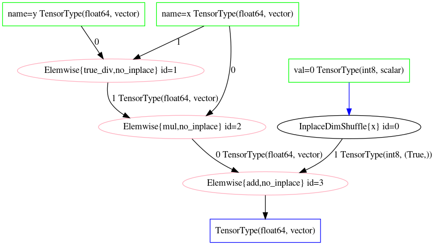
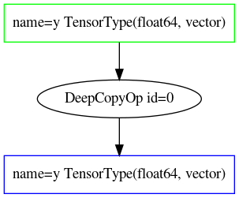

#+TITLE: 第十章：概率编程语言
#+LANGUAGE: zh-CN
#+OPTIONS: toc:3 num:2
#+STARTUP: showall

<<chap10>>

* 第 10 章 概率编程语言

=原著：Osvaldo A. Martin、Ravin Kumar、Junpeng Lao=

=完整正文依据：markdown/chp_10.md；代码起点：notebooks_updated/chp_10.ipynb=

#+BEGIN_QUOTE
*中文版来源与现代化说明*：本章完整翻译原书第 10 章，并保留原有章节锚点、公式标签、
代码块名称、图号、引文和脚注。原文讨论 PyMC3、Theano 与 Aesara 的地方具有重要历史意义；
在叙述当前可运行实现时，中文版明确标注 *[中文版现代化]*，并使用当前公开的 PyMC、
PyTensor、TensorFlow Probability、JAX 与 NumPyro API。仅为验证语义、确定性和错误处理而
增加的内容标注 *[中文版新增检查]*。历史 API 示例保留为不可执行的文本片段，不伪装成当前
API。所有 MCMC 示例都有 =smoke=/=release= 两档确定性预算；默认发布档保留原书十万次抽样
的对照实验，而 smoke 档显著缩减预算。环境变量 ~BMCP_RUN_INFERENCE=0~ 可显式跳过推断。
#+END_QUOTE

在第 [[chap1][1]] 章 [[bayesian_modeling]] 一节中，我们用汽车作类比来理解应用贝叶斯方法。
现在我们再次借用这个类比，不过这一次是为了理解概率编程语言（Probabilistic Programming
Languages，PPL）。如果把汽车看作一个系统，它的用途就是借助与动力源相连的车轮，把人或货物
运送到选定目的地。整个系统通过一个界面呈现给用户，通常就是方向盘和踏板。汽车和所有物理对象
一样必须遵守物理定律，但在这些边界内，人类设计者仍然可以从许多部件中做出选择：发动机可以大
也可以小，轮胎可以宽也可以窄，座位可以只有 1 个，也可以有 8 个。不过最终设计总要服务于特定
用途。有些车是为载着一个人在赛道上高速行驶而设计的，比如一级方程式赛车；另一些车则为家庭
生活而设计，比如把一家人和采购的杂货从商店带回家。无论目的是什么，总得有人为合适的用途挑选
合适的部件，造出合适的汽车。

概率编程语言的故事与此类似。PPL 的目的是帮助贝叶斯实践者搭建生成模型，解决手头的问题；
例如，通过 MCMC 估计后验分布来完成贝叶斯模型的推断。计算贝叶斯方法的动力源当然是计算机，
而计算机受计算机科学基本原理约束。不过在这些边界内，PPL 设计者可以选择不同部件与界面，
具体选择取决于预期用户的需求和偏好。本章会重点讨论 PPL 包含哪些部件，以及这些部件可以采用
哪些不同设计。作为贝叶斯实践者，这些知识能帮助你在开始项目时选择 PPL，也能帮助你排查统计
工作流里出现的问题。最终，这种理解会让现代贝叶斯实践者获得更好的使用体验。

<<a-systems-engineering-perspective-of-a-ppl>>

** 从系统工程视角看 PPL

维基百科把系统工程定义为“一个跨学科的工程与工程管理领域，重点研究如何在复杂系统的整个
生命周期中设计、集成和管理这些系统”。按照这个定义，PPL 就是复杂系统。它们横跨计算后端、
算法和基础语言。定义还强调，部件之间的集成是系统工程的关键，PPL 也是如此：计算后端的选择
可能影响界面，基础语言的选择可能限制可用的推断算法。在一些 PPL 中，用户自己可以选择部分
部件。例如，Stan 用户可以在 R、Python、命令行界面等多种基础接口之间选择；而 PyMC 用户
不能更换基础语言，必须使用 Python。

除了 PPL 本身，还要考虑使用它的组织以及具体使用方式。研究实验室里使用 PPL 的博士生，与
企业里使用 PPL 的工程师有不同需求。这也与 PPL 的生命周期有关：研究者也许只需要在短期内
运行模型一两次来写论文，而企业工程师可能需要在几年时间里持续维护和运行同一个模型。

PPL 有两个必需部件：一套供用户定义模型的应用程序编程接口（API）[fn:1]，以及执行推断并管理
计算的算法。其他部件也会存在，但主要是为了从某个方面改善系统，例如提升计算速度或易用性。
无论选了哪些部件，如果系统设计良好，日常用户就不必了解其全部复杂性，正如大多数司机不需要
理解汽车每一个部件的细节。理想情况下，PPL 用户只会感觉“一切恰好按我希望的方式工作”。
这正是 PPL 设计者必须面对的挑战。

本章余下部分会概览 PPL 的一些通用部件，并用不同 PPL 的设计选择作为例子。我们的目标不是
穷举所有 PPL[fn:2]，也不是劝你去开发一门 PPL[fn:3]。我们希望，通过理解这些实现层面的考量，
你能更好地写出计算性能更好的贝叶斯模型，并在计算瓶颈与错误出现时诊断它们。

<<example-rainier>>

*** 示例：Rainier

考虑 Rainier[fn:4] 的开发过程。Rainier 是 Stripe 开发的一门、用 Scala 编写的 PPL。Stripe
是一家支付处理公司，为成千上万家合作企业处理资金业务。Stripe 需要估计与每家合作企业相关的
风险分布；理想的 PPL 应该能支持大量并行推断（每家合作企业一次），也容易部署到 Stripe 的
计算集群。由于这些集群包含 Java 运行时环境，开发者选择了可以编译成 Java 字节码的 Scala。
当时也考虑过 PyMC3 和 Stan，但前者受限于 Python，后者要求 C++ 编译器；因此，对这个特定
用例来说，开发一门 PPL 是最佳选择。

大多数用户不需要开发自己的 PPL。我们介绍这个案例，是为了强调：既要考虑代码所在环境，也要
考虑现有 PPL 的功能；把两者放在一起，才能帮助计算贝叶斯实践者做出更顺畅的选择。

<<posterior-computation>>

** 后验计算

“推断”被定义为依据证据和推理得出的结论，而后验计算方法就是把我们带到这个结论的引擎。
后验计算大体可以分成两部分：计算算法，以及执行计算的软件和硬件，后者通常统称为计算后端。
无论是在设计还是选择 PPL，可用的后验计算方法最终都会成为一个关键决定，影响工作流中的许多
因素，包括推断速度、所需硬件、PPL 的复杂度以及适用范围。

计算后验的算法很多[fn:5]：从共轭模型的精确计算，到网格搜索、哈密顿蒙特卡洛（HMC）等数值
近似，再到拉普拉斯近似和变分推断等模型近似（详见 [[vi_details]]）。选择推断算法时，PPL
设计者与用户都需要做出一系列取舍。对设计者来说，各算法的实现复杂度不同。共轭方法很容易实现，
因为解析公式通常只要几行代码；MCMC 采样器则复杂得多，往往需要写出远多于解析解的代码。
计算复杂度也存在取舍：共轭方法几乎不需要计算能力，在所有现代硬件、甚至手机上都能在亚毫秒
时间内返回后验；相比之下，HMC 较慢，而且需要能计算梯度的系统，例如
[[auto_grad]] 一节将介绍的系统。这使 HMC 通常需要较强的计算机，有时还需要专用硬件。

用户也面临类似困境。更高级的后验计算方法通常更通用、对数学专长要求更低，但用户需要更多知识
来评估并确保拟合正确。全书已经反复看到这一点：必须使用可视化和数值诊断，才能确认 MCMC
采样器已经收敛到后验的一个/估计/。共轭模型则不需要收敛诊断，因为只要数学使用正确，它每一次
都会/精确/计算后验。

因此，不存在适用于所有情形的统一推断算法建议。原书写作时，MCMC 方法——尤其是自适应动态
哈密顿蒙特卡洛——最为灵活，但仍不适用于所有情形。作为用户，理解各种算法是否可用以及各自的
取舍，值得你投入时间；这样才能针对每个具体问题做出判断。

#+NAME: ch10-imports-config
#+BEGIN_SRC python
import importlib.util
import os
from pathlib import Path
import timeit

from scipy import stats
import numpy as np

EXECUTION_PROFILE = os.environ.get("BMCP_EXECUTION_PROFILE", "release").lower()
if EXECUTION_PROFILE not in {"smoke", "release"}:
    raise ValueError("BMCP_EXECUTION_PROFILE 必须是 smoke 或 release")

# [中文版现代化] 原书两个对照模型各抽取 100_000 次。发布档保留该预算；
# smoke 档显著缩减，并默认跳过 MCMC，避免把轻量检查变成完整推断。
if EXECUTION_PROFILE == "smoke":
    TRANSFORM_DRAWS, TRANSFORM_TUNE = 300, 300
    PRIOR_SAMPLES, SHAPE_ROWS = 20, 100
else:
    TRANSFORM_DRAWS, TRANSFORM_TUNE = 100_000, 1_000
    PRIOR_SAMPLES, SHAPE_ROWS = 100, 1_000

RUN_INFERENCE = os.environ.get(
    "BMCP_RUN_INFERENCE", "1" if EXECUTION_PROFILE == "release" else "0"
) == "1"
RANDOM_SEED = 202410

# [中文版新增检查] 本章没有外部数据依赖；运算图是唯一的生成资产。
DATA_FILES = ()
ASSET_DIR = Path("generated")
# 中文版现代化说明：ASSET_DIR 在隔离构建中每次都从空目录开始（不会带入陈旧的
# 历史输出），因此确定性回退 PNG不能直接放在 ASSET_DIR 里——必须放在构建器会
# 完整复制、不会被当成"待清空的生成目录"的 static/ 下，缺少渲染器时再显式拷贝
# 到 ASSET_DIR，两者用途不冲突。
STATIC_ASSET_DIR = Path("static")
EXPECTED_ASSETS = {
    "symbolic_graph_unopt.png",
    "symbolic_graph_opt.png",
}
assert DATA_FILES == ()
assert EXPECTED_ASSETS == {
    "symbolic_graph_unopt.png",
    "symbolic_graph_opt.png",
}

FRAMEWORKS = (
    "pymc", "pytensor", "jax", "tensorflow", "tensorflow_probability", "numpyro"
)
FRAMEWORK_AVAILABILITY = {
    name: importlib.util.find_spec(name) is not None for name in FRAMEWORKS
}
FRAMEWORK_AVAILABILITY
#+END_SRC
#+RESULTS: output
#+BEGIN_EXAMPLE
{'pymc': True,
 'pytensor': True,
 'jax': True,
 'tensorflow': True,
 'tensorflow_probability': True,
 'numpyro': True}
#+END_EXAMPLE

<<auto_grad>>

*** 获得梯度

梯度是计算数学中极其有用的信息。在一维函数里，它也叫斜率或导数，表示函数输出在定义域中任意
一点变化得有多快。许多算法利用梯度，更高效地达到目标。在推断算法中，我们已经比较过这种差异：
Metropolis–Hastings 采样不需要梯度，而哈密顿蒙特卡洛使用梯度，通常能更快返回高质量样本[fn:6]。

正如马尔可夫链蒙特卡洛最初是在统计力学这个子领域中发展起来，后来才被计算贝叶斯学者采用，
许多梯度求值库最初也是“深度学习”库的一部分，主要用于计算反向传播来训练神经网络，例如
Theano、TensorFlow 和 PyTorch。贝叶斯学者随后学会把它们用作贝叶斯推断的计算后端。代码块
[[jax_grad_small][jax_grad_small]] 使用专门的自动微分库 JAX [cite:@jax2018github]，展示了
计算梯度的例子：在 $x=4$ 处计算 $x^2$ 的梯度。用解析规则 $rx^{r-1}$，我们可以得到
$2\times4=8$；但借助自动微分库，用户不必思考闭式解，只要写出函数本身，计算机就能自动计算
梯度——“自动微分”里的“自动”正是这个意思。

*代码 10.1（原锚点 =jax_grad_small=）*

<<ch10-code-jax-grad-small>>
#+NAME: jax_grad_small
#+BEGIN_SRC python
from jax import grad

simple_grad = grad(lambda x: x**2)
simple_grad_at_four = simple_grad(4.0)
print(simple_grad_at_four)

# [中文版新增检查] 解析结果为 2 * 4 = 8。
np.testing.assert_allclose(np.asarray(simple_grad_at_four), 8.0)
#+END_SRC
#+RESULTS: stdout
#+BEGIN_EXAMPLE
8.0
#+END_EXAMPLE

自适应动态哈密顿蒙特卡洛和变分推断等方法，会利用梯度来估计后验分布。当我们意识到，后验计算
通常需要成千上万次计算梯度时，轻松获得梯度就变得更加重要。代码块
[[jax_model_grad][jax_model_grad]] 用 JAX 对一个小型“手工搭建”模型做了一次这样的计算。

*代码 10.2（原锚点 =jax_model_grad=）*

<<ch10-code-jax-model-grad>>
#+NAME: jax_model_grad
#+BEGIN_SRC python
from jax import grad
from jax.scipy.stats import norm

def jax_log_model(test_point, observed):
    z_logpdf = norm.logpdf(test_point, loc=0, scale=5)
    x_logpdf = norm.logpdf(observed, loc=test_point, scale=1)
    return z_logpdf + x_logpdf

jax_model_grad = grad(jax_log_model)
observed, test_point = 5.0, 2.5
jax_logp_value = jax_log_model(test_point, observed)
jax_gradient_value = jax_model_grad(test_point, observed)
print(f"logp：{jax_logp_value}")
print(f"梯度：{jax_gradient_value}")
#+END_SRC
#+RESULTS: stdout
#+BEGIN_EXAMPLE
logp：-6.697315216064453
梯度：2.4000000953674316
#+END_EXAMPLE

为了比较，我们可以用 PyMC 搭建同一个模型，并让当前 PyTensor 后端计算梯度。原书代码块
[[pymc3_model_grad][pymc3_model_grad]] 使用 PyMC3 与 Theano；下面的实现保持统计模型不变，
但使用当前公开的 =Model.compile_logp()= 与 =Model.compile_dlogp()= API。

*[中文版现代化] 代码 10.3（保留原锚点 =pymc3_model_grad=）*

<<ch10-code-pymc-model-grad>>
#+NAME: pymc3_model_grad
#+BEGIN_SRC python
import pymc as pm

with pm.Model() as pymc_gradient_model:
    z = pm.Normal("z", 0.0, 5.0)
    x_obs = pm.Normal("x", mu=z, sigma=1.0, observed=observed)

pymc_logp_fn = pymc_gradient_model.compile_logp()
pymc_dlogp_fn = pymc_gradient_model.compile_dlogp()
pymc_point = pymc_gradient_model.initial_point()
pymc_point["z"] = np.asarray(test_point)

pymc_logp_value = pymc_logp_fn(pymc_point)
pymc_gradient_value = pymc_dlogp_fn(pymc_point)
print(pymc_logp_value, pymc_gradient_value)

# [中文版新增检查] 两个 PPL/后端对同一模型应给出相同的 logp 与梯度。
np.testing.assert_allclose(pymc_logp_value, np.asarray(jax_logp_value), rtol=1e-6)
np.testing.assert_allclose(
    np.asarray(pymc_gradient_value).reshape(-1)[0],
    np.asarray(jax_gradient_value),
    rtol=1e-6,
)
#+END_SRC
#+RESULTS: stdout
#+BEGIN_EXAMPLE
-6.697315008914228 [2.4]
#+END_EXAMPLE

<<conjugate_case_study>>

*** 示例：近实时推断

设想一个信用卡公司的统计师，希望快速发现信用卡欺诈，从而在窃贼继续交易之前冻结卡片。另一个
系统已经把交易分类为欺诈或正常，但公司不希望仅凭很少的事件就封卡，同时希望能为不同客户设置
不同先验来控制敏感度。团队决定：当后验分布的均值高于 50% 的概率阈值时，就冻结用户账户。
在这种近实时场景中，推断必须在不到一秒内完成，才能在交易清算前发现欺诈。统计师意识到，可以
用共轭模型解析表达这个问题，如公式 [[eq:conjugate_beta_fraud]] 所示。参数 $\alpha$ 与
$\beta$ 分别直接表示欺诈交易和非欺诈交易的先验；观察到交易后，数据几乎可以直接用于计算后验
参数。

<<eq:conjugate_beta_fraud>>
#+NAME: eq:conjugate_beta_fraud
\[
\begin{split}
    \alpha_\text{post} &= \alpha_\text{prior} + \texttt{fraud\_observations} \\
    \beta_\text{post} &= \beta_\text{prior} + \texttt{non\_fraud\_observations} \\
    p(\theta \mid y) &= \text{Beta}(\alpha_\text{post}, \beta_\text{post}) \\
    \mathop{\mathbb{E}}[p(\theta \mid y)]
      &= \frac{\alpha_\text{post}}{\alpha_\text{post}+\beta_\text{post}}
\end{split}
\]

然后，她可以相当直接地把这些计算写成 Python，如代码块 [[fraud_detector][fraud_detector]] 所示。
这里甚至不需要外部库，因此函数很容易部署。

*代码 10.4（原锚点 =fraud_detector=）*

<<ch10-code-fraud-detector>>
#+NAME: fraud_detector
#+BEGIN_SRC python
def fraud_detector(
    fraud_observations,
    non_fraud_observations,
    fraud_prior=8,
    non_fraud_prior=6,
):
    # 欺诈检测的共轭 Beta-Binomial 模型。
    expectation = (fraud_prior + fraud_observations) / (
        fraud_prior
        + fraud_observations
        + non_fraud_prior
        + non_fraud_observations
    )
    if expectation > 0.5:
        return {"suspend_card": True}
    return {"suspend_card": False}

fraud_result = fraud_detector(2, 0)
elapsed = timeit.timeit(lambda: fraud_detector(2, 0), number=100_000)
print(fraud_result, f"每次约 {elapsed / 100_000:.3e} 秒")
assert fraud_result == {"suspend_card": True}
#+END_SRC
#+RESULTS: stdout
#+BEGIN_EXAMPLE
{'suspend_card': True} 每次约 3.234e-07 秒
#+END_EXAMPLE

为满足不到一秒的敏感度与概率计算时间要求，统计师选择了共轭先验，并在代码块
[[fraud_detector][fraud_detector]] 中直接计算后验。原书机器上计算约耗时 152 纳秒；相比之下，
同一台机器上的 MCMC 采样约需 2 秒，慢了 6 个数量级以上。任何 MCMC 采样器都不太可能满足
这个系统的时限，因此共轭先验显然更合适。具体时间会随硬件、解释器与基准方法变化，重要的是
数量级差异，而不是复现某个固定纳秒数。

#+BEGIN_QUOTE
*硬件与采样速度*

从硬件角度看，提高 MCMC 采样速度通常有三种办法。第一种是提高处理单元的时钟频率，通常用
赫兹表示，现代计算机常用千兆赫兹。它表示指令执行速度；粗略来说，4 GHz 计算机每秒能执行的
指令约为 2 GHz 计算机的两倍。在 MCMC 中，单条链在固定时间内能取得多少样本，通常与时钟
频率相关。第二种是跨处理单元的多个核心并行化。多核计算机可以并行抽取多条 MCMC 链；巧的是，
许多收敛指标本来也需要多条链。现代桌面计算机通常有 2 到 16 个核心。最后一种办法是使用图形
处理器（GPU）和张量处理器（TPU）等专用硬件。若软件和算法适配得当，它们既能加快每条链，
也能并行抽取更多链。
#+END_QUOTE

<<application-programming-interfaces>>

** 应用程序编程接口

应用程序编程接口（API）“定义多个软件中介之间的交互”。在贝叶斯场景中，最狭义的定义是用户
与后验计算方法之间的交互；最广义的定义则可以涵盖贝叶斯工作流的多个步骤，例如用分布指定随机
变量、连接随机变量来创建模型、进行先验和后验预测检验、绘图，乃至任何其他任务。API 通常是
PPL 实践者最先接触的部分，有时也是唯一接触的部分；实践者大部分时间也往往花在这里。API 设计
既是科学，也是艺术，设计者必须平衡许多考虑。

在科学层面，PPL 必须能与计算机交互，并提供控制计算方法所需的元素。许多 PPL 构建在基础语言
之上，通常必须遵守基础语言和计算后端的固定约束。在 [[conjugate_case_study]] 一节中，
只需 4 个参数和一行核心代码就得到了精确结果；对比 MCMC 示例，它们还要输入抽样次数、接受率、
调优步数等。MCMC 的大部分复杂性虽然被隐藏起来，仍会在 API 中显露出额外复杂度。

#+BEGIN_QUOTE
*这么多 API，这么多界面*

现代贝叶斯工作流中，不只有 PPL 的 API，还有所有配套软件包的 API。本书示例还使用了 NumPy、
Matplotlib、SciPy、Pandas 和 ArviZ，更不用说 Python 自身的 API。在 Python 生态中，选用哪些
软件包、接受哪些 API，也属于个人选择。实践者可以用 Bokeh 替代 Matplotlib 绘图，也可以在
Pandas 之外使用 xarray；这样一来，用户也必须学习相应 API。

除了 API，还有许多用来编写贝叶斯模型或一般代码的界面：文本编辑器、Notebook、集成开发环境
（IDE），或者直接使用命令行。这些配套包和编码界面并不互斥。对计算统计新手来说，一下子面对
这么多选择可能压力很大。刚开始时，我们建议使用简单文本编辑器和少量配套包，把注意力放在代码
与模型上；熟悉之后再迁移到 Notebook 或 IDE 等更复杂界面。更多建议见 [[dev_environment]]。
#+END_QUOTE

在艺术层面，API 是面向人类用户的界面，也是 PPL 最重要的部分之一。一些用户会对设计选择抱有
强烈、但主观的看法。用户希望 API 最简单、最灵活、最易读、最容易编写；可怜的 PPL 设计者面对
的这些目标不仅定义模糊，而且彼此冲突。设计者可以让 API 模仿基础语言的风格与功能。例如，
“Pythonic”程序被认为遵循某种 Python 风格[fn:7]。PyMC 的 API 正受这种理念影响，目标就是让用户
明确感觉自己在用 Python 写模型。相比之下，Stan 模型使用一种领域特定语言，其设计受到 BUGS
[cite:@gilks_thomas_spiegelhalter_1994] 等 PPL 以及 C++ [cite:@carpenter_2017] 等语言影响。
Stan 语言包含花括号、代码块语法等鲜明原语，如代码块 [[code_stan][code_stan]] 所示。写 Stan
模型显然/不像/写 Python，但这并不是对 API 的批评；它只是不同的设计选择，为用户带来不同体验。

<<example-stan-and-slicstan>>

*** 示例：Stan 与 SlicStan

不论其他 PPL 部件如何，不同用例的用户可能偏好不同的模型规范抽象层次。Gorinova 等人
[cite:@Gorinova_2019] 对 Stan 与 SlicStan 的研究，正是专门讨论并提出 Stan API。代码块
[[code_stan][code_stan]] 展示原始 Stan 模型语法。Stan 用代码块声明贝叶斯模型的不同部分；这些
名称对应工作流的不同环节，例如模型与参数规范、数据变换、先验与后验预测抽样，对应的代码块名
包括 =parameters=、=model=、=transformed parameters= 和 =generated quantities=。

*原书历史代码块 =code_stan=：*

#+BEGIN_SRC stan
parameters {
    real y_std;
    real x_std;
}
transformed parameters {
    real y = 3 * y_std;
    real x = exp(y/2) * x_std;
}
model {
    y_std ~ normal(0, 1);
    x_std ~ normal(0, 1);
}
#+END_SRC

SlicStan [cite:@Gorinova_2019] 为 Stan 模型提供另一种语法；同一个模型见代码块
[[slicstan][slicstan]]。SlicStan 为 Stan 提供可组合界面，让用户定义、命名并复用函数，同时取消
代码块语法。因此，SlicStan 程序可以用比标准 Stan 更少的代码表达。代码量并不总是最重要的指标，
但更少的代码意味着贝叶斯建模者写得更少，模型审阅者读得也更少。与 Python 类似，可组合函数让
用户只定义一次想法，随后反复使用，例如片段中的 =my_normal=。

*原书历史代码块 =slicstan=：*

#+BEGIN_SRC text
real my_normal(real m, real s) {
    real std ~ normal(0, 1);
    return s * std + m;
}
real y = my_normal(0, 3);
real x = my_normal(0, exp(y/2));
#+END_SRC

原始 Stan 语法的优点是熟悉度（对已有用户而言）和文档积累。Stan 选择模仿 BUGS，因此有该语言
经验的用户更容易迁移；多年使用 Stan 的人也早已熟悉这种语法。Stan 自 2012 年发布以来，用户
已经积累了多年经验，发表了许多示例并写出大量模型。对新用户来说，代码块结构会强制组织程序，
使 Stan 程序更一致。

Stan 与 SlicStan 在 API 层之下使用相同代码库，API 差异完全是为了用户。在这个案例中，哪个 API
“更好”取决于每位用户。这里对 Stan API 的讨论很浅；完整细节请阅读原论文，其中形式化描述了
两套语法，也展示了 API 设计需要深入到何种程度。

<<example-pymc3-and-pymc4>>

*** 示例：PyMC3 与 PyMC4

第二个 API 案例研究展示了计算后端变化如何迫使 API 改变：从 PyMC3 的 Theano，转向当时计划
用 TensorFlow 构建、并替代 PyMC3 的 PyMC4 [cite:@kochurovpymc4]。PyMC4 的设计者希望语法
尽可能接近 PyMC3。虽然推断算法保持不变，但 TensorFlow 与 Python 的基本工作方式，使 PyMC4
API 因计算后端变化而不得不采用特定设计。下面分别保留八校模型 [cite:@rubin_1981] 的 PyMC3
语法和如今已经终止[fn:8]的 PyMC4 语法。这两个代码块用于历史比较，不应在当前环境中执行。

*原书历史代码块 =pymc3_schools=：*

#+BEGIN_SRC python
with pm.Model() as eight_schools_pymc3:
    mu = pm.Normal("mu", 0, 5)
    tau = pm.HalfCauchy("tau", 5)
    theta = pm.Normal("theta", mu=mu, sigma=tau, shape=8)
    obs = pm.Normal("obs", mu=theta, sigma=sigma, observed=y)
#+END_SRC

*原书历史代码块 =pymc4_schools=（含源代码勘误）：*

#+BEGIN_QUOTE
*[中文版勘误]* 原书源片段把 =theta= 的尺度误写成观测标准差 =sigma=，并把最后一行构造器
误写成与该片段其余部分不一致的 =pm4.Normal=。下面分别更正为层级尺度 =tau= 和 =pm.Normal=；
其余已终止的 PyMC4 协程 API 保持历史原貌，仍不可在当前环境中执行。
#+END_QUOTE

#+BEGIN_SRC python
@pm.model
def eight_schools_pymc4():
    mu = yield pm.Normal("mu", 1, 5)
    tau = yield pm.HalfNormal("tau", 5)
    theta = yield pm.Normal("theta", loc=mu, scale=tau, batch_stack=8)
    obs = yield pm.Normal("obs", loc=theta, scale=sigma, observed=y)
    return obs
#+END_SRC

PyMC4 的差异包括装饰器 =@pm.model=、Python 函数声明、用 =yield= 表示生成器，以及不同参数名。
你可能注意到，这里的 =yield= 和 TensorFlow Probability 代码中的一样；两个 PPL 都因为选择协程
而必须在 API 中使用 =yield=。但这些 API 变化并非设计者所愿：用户必须学习新语法，已有 PyMC3
代码全部需要重写，已有文档也会过时。这个例子说明，API 有时不是由用户偏好决定，而是由后验
计算所用后端决定。最终，用户希望保留 PyMC3 API 的反馈，成为终止 PyMC4 开发的原因之一。

#+BEGIN_QUOTE
*[中文版现代化] 当前事实*：PyMC 项目后来并没有迁移到这套 PyMC4/TensorFlow API，而是沿着
PyMC3 熟悉的上下文管理器 API 继续发展，并把计算后端从 Theano/Aesara 演进到 PyTensor。
本章其余可执行 PyMC 示例均使用这一当前公开路线。
#+END_QUOTE

<<ppl-driven-transformations>>

** 由 PPL 驱动的变换

本书已经见过许多数学变换：有些让我们容易、灵活地定义多种模型，例如广义线性模型；有些让结果
更容易解释，例如中心化。本节专门讨论更多由 PPL 自身驱动的变换。它们有时比较隐式，我们会看
两个例子。

<<log_probabilities>>

*** 对数概率

最常见的变换之一是对数概率变换。为了理解原因，我们来计算一个任意似然。假设观察到两个独立结果
$y_0$ 与 $y_1$，它们的联合概率为：

<<eq:expanded_likelihood>>
#+NAME: eq:expanded_likelihood
\[
p(y_0,y_1\mid\boldsymbol{\theta})
= p(y_0\mid\boldsymbol{\theta})p(y_1\mid\boldsymbol{\theta})
\]

具体来说，假设我们两次都观察到数值 2，并决定在模型中使用正态分布作为似然。把公式
[[eq:expanded_likelihood]] 展开，可写成：

<<eq:expanded_likelihood_normal>>
#+NAME: eq:expanded_likelihood_normal
\[
\mathcal{N}(2,2\mid\mu=0,\sigma=1)
=\mathcal{N}(2\mid0,1)\mathcal{N}(2\mid0,1)
\]

身为计算统计学家，我们可以用少量代码计算这个值。

*代码 10.9（原锚点 =two_observed=）*

<<ch10-code-two-observed>>
#+NAME: two_observed
#+BEGIN_SRC python
observed = np.repeat(2, 2)
pdf = stats.norm(0, 1).pdf(observed)
two_observed_joint_pdf = np.prod(pdf, axis=0)
two_observed_joint_pdf
#+END_SRC
#+RESULTS: output
#+BEGIN_EXAMPLE
np.float64(0.0029150244650281948)
#+END_EXAMPLE

只有两个观测时，代码块 [[two_observed][two_observed]] 可以无碍地给出很多位精度。但现在假设
总共有 1000 个观测，而且都等于 2。我们在代码块 [[thousand_observed][thousand_observed]] 中
重复计算。这一次出现了问题：Python 报告联合概率密度为 0.0，而这不可能是真实数学结果。

*代码 10.10（原锚点 =thousand_observed=）*

<<ch10-code-thousand-observed>>
#+NAME: thousand_observed
#+BEGIN_SRC python
observed = np.repeat(2, 1_000)
pdf = stats.norm(0, 1).pdf(observed)
thousand_observed_product = np.prod(pdf, axis=0)
print(thousand_observed_product)
assert thousand_observed_product == 0.0  # 浮点下溢，而不是数学概率真的为零。
#+END_SRC
#+RESULTS: stdout
#+BEGIN_EXAMPLE
0.0
#+END_EXAMPLE

这里看到的是计算机的/浮点精度/误差。由于计算机在内存中存储数字和执行计算的基本方式，可用精度
是有限的。在 Python 中，这类误差通常被隐藏起来[fn:9]；不过有时用户会直接看到精度不足，例如代码块
[[imperfect_subtract][imperfect_subtract]]。

*代码 10.11（原锚点 =imperfect_subtract=）*

<<ch10-code-imperfect-subtract>>
#+NAME: imperfect_subtract
#+BEGIN_SRC python
imperfect_result = 1.2 - 1
imperfect_result
#+END_SRC
#+RESULTS: output
#+BEGIN_EXAMPLE
0.19999999999999996
#+END_EXAMPLE

对相对“较大”的数字来说，发生在很远小数位上的微小误差影响不大。然而在贝叶斯建模中，我们经常
处理非常小的浮点数，更糟的是还会把它们反复相乘，使其越来越小。为了缓解这个问题，PPL 会对概率
做对数变换，通常简写为 /logp/。于是公式 [[eq:expanded_likelihood]] 变成：

<<eq:expanded_loglikelihood>>
#+NAME: eq:expanded_loglikelihood
\[
\log p(y_0,y_1\mid\boldsymbol{\theta})
=\log p(y_0\mid\boldsymbol{\theta})+\log p(y_1\mid\boldsymbol{\theta})
\]

这会带来两个效果：把很小的数变得相对较大；并根据对数的乘积法则，把乘法改成加法。对同一个例子
改在对数空间计算，代码块 [[log_transform][log_transform]] 得到数值上更稳定的结果。

*代码 10.12（原锚点 =log_transform=）*

<<ch10-code-log-transform>>
#+NAME: log_transform
#+BEGIN_SRC python
logpdf = stats.norm(0, 1).logpdf(observed)
log_transform_result = (np.log(pdf[0]), logpdf[0], logpdf.sum())
print(log_transform_result)
np.testing.assert_allclose(log_transform_result[0], log_transform_result[1])
assert np.isfinite(log_transform_result[2])
#+END_SRC
#+RESULTS: stdout
#+BEGIN_EXAMPLE
(np.float64(-2.9189385332046727), np.float64(-2.9189385332046727), np.float64(-2918.9385332046736))
#+END_EXAMPLE

<<random-variables-and-distributions-transformations>>

*** 随机变量与分布变换

服从有界分布的随机变量——例如定义在固定区间 $[a,b]$ 上的均匀分布——会给梯度计算和基于梯度
的采样器带来挑战。几何形状的突然变化，使采样器很难在变化附近采样。可以想象让球从楼梯或悬崖
滚下，而不是沿平滑表面滚动；球在平滑表面上的轨迹更容易估计。

因此，PPL 中另一类有用变换[fn:10]，是把服从均匀、Beta、半正态等有界分布的随机变量，转换为跨越
整条实数轴 $(-\infty,\infty)$ 的无界随机变量。不过必须谨慎，因为变换会改变分布的体积，需要
用变换的雅可比行列式进行校正，并累积对应的对数概率，详见 [[transformations]]。

PPL 通常把有界随机变量转换到无界空间，在无界空间中推断，再把结果变回原来的有界空间；所有这些
都可以在没有用户输入的情况下发生。因此，如果用户不想直接处理这些变换，就不必处理。均匀随机
变量的正向与反向变换见公式 [[eq:interval_transform]]，代码块
[[interval_transform][interval_transform]] 计算了正向变换。下界 $a$ 和上界 $b$ 分别映射到
$-\infty$ 和 $\infty$，中间值也相应“拉伸”。

<<eq:interval_transform>>
#+NAME: eq:interval_transform
\[
\begin{split}
    x_t &= \log(x-a)-\log(b-x)\\
    x &= a+\frac{1}{1+e^{-x_t}}(b-a)
\end{split}
\]

*代码 10.13（原锚点 =interval_transform=）*

<<ch10-code-interval-transform>>
#+NAME: interval_transform
#+BEGIN_SRC python
lower, upper = -1, 2
domain = np.linspace(lower, upper, 5)
with np.errstate(divide="ignore"):
    transformed_domain = np.log(domain - lower) - np.log(upper - domain)
print(f"原始定义域：{domain}")
print(f"变换后定义域：{transformed_domain}")
assert np.isneginf(transformed_domain[0])
assert np.isposinf(transformed_domain[-1])
np.testing.assert_allclose(transformed_domain[2], 0.0)
#+END_SRC
#+RESULTS: stdout
#+BEGIN_EXAMPLE
原始定义域：[-1.   -0.25  0.5   1.25  2.  ]
变换后定义域：[       -inf -1.09861229  0.          1.09861229         inf]
#+END_EXAMPLE

把均匀随机变量加入 PyMC 模型并检查模型初始点，可以看到自动变换。原书
[[uniform_transform][uniform_transform]] 使用 =model.vars= 查看 PyMC3 内部对象；下面改用当前公开
的 =Model.initial_point()=，读取采样空间中的值变量名称。

*[中文版现代化] 代码 10.14（原锚点 =uniform_transform=）*

<<ch10-code-uniform-transform>>
#+NAME: uniform_transform
#+BEGIN_SRC python
with pm.Model() as uniform_model:
    uniform_x = pm.Uniform("x", -1.0, 2.0)

uniform_initial_point = uniform_model.initial_point()
uniform_value_name = next(iter(uniform_initial_point))
print(uniform_initial_point)
assert uniform_value_name.endswith("_interval__")
#+END_SRC
#+RESULTS: stdout
#+BEGIN_EXAMPLE
{'x_interval__': array(0.)}
#+END_EXAMPLE
#+RESULTS: stdout
#+BEGIN_EXAMPLE

#+END_EXAMPLE

看到这个变换后，还可以查询变换前后（含或不含雅可比修正）的 logp。注意：采样空间里的数值
$-2$ 与 $1$ 已经不是原始均匀变量本身，所以即使它们位于原始区间 $(-1,2)$ 之外，也能得到有限
logp。关闭雅可比修正时，两个数值具有相同 logp；打开修正时，PPL 会自动加入体积校正。

*[中文版现代化] 代码 10.15（原锚点 =uniform_transform_logp=；原 Notebook 标作 10.14 后续）*

<<ch10-code-uniform-logp>>
#+NAME: uniform_transform_logp
#+BEGIN_SRC python
uniform_logp = uniform_model.compile_logp(jacobian=True)
uniform_logp_nojac = uniform_model.compile_logp(jacobian=False)

uniform_point_a = {uniform_value_name: np.asarray(-2.0)}
uniform_point_b = {uniform_value_name: np.asarray(1.0)}
values_a = (uniform_logp(uniform_point_a), uniform_logp_nojac(uniform_point_a))
values_b = (uniform_logp(uniform_point_b), uniform_logp_nojac(uniform_point_b))
print(*values_a)
print(*values_b)
np.testing.assert_allclose(values_a[1], values_b[1])
assert np.isfinite(values_a[0]) and np.isfinite(values_b[0])
#+END_SRC
#+RESULTS: stdout
#+BEGIN_EXAMPLE
-2.2538560220859454 -1.0986123
-1.6265233750364456 -1.0986123
#+END_EXAMPLE

概率的对数变换和随机变量的无界化，通常在用户不知情时由 PPL 应用，但都会实际影响很多模型中的
性能与易用性。

用户也可以对分布本身显式执行其他变换，构造新分布，再让模型中的随机变量服从这些分布。例如，
TFP 的 bijector 模块 [cite:@dillon2017tensorflow] 可以把基础分布转换成更复杂的分布。代码块
[[bijector_lognormal][bijector_lognormal]] 通过变换基础分布 $\mathcal{N}(0,1)$，构造
$\operatorname{LogNormal}(0,1)$[fn:11]。这种富有表达力的 API 甚至允许用户借助可训练的 bijector
（例如神经网络 [cite:@papamakarios2019normalizing]）定义复杂变换，如
=tfb.MaskedAutoregressiveFlow=。

*代码 10.16（原锚点 =bijector_lognormal=）*

<<ch10-code-tfp-bijector>>
#+NAME: bijector_lognormal
#+BEGIN_SRC python
import tensorflow_probability as tfp

tfd = tfp.distributions
tfb = tfp.bijectors

lognormal_direct = tfd.LogNormal(loc=0.0, scale=1.0)
lognormal_transformed = tfd.TransformedDistribution(
    distribution=tfd.Normal(loc=0.0, scale=1.0),
    bijector=tfb.Exp(),
)
lognormal_samples = lognormal_direct.sample(PRIOR_SAMPLES, seed=(RANDOM_SEED, 16))

# [中文版新增检查] 两种公开构造方式应定义同一个分布。
np.testing.assert_allclose(
    lognormal_direct.log_prob(lognormal_samples),
    lognormal_transformed.log_prob(lognormal_samples),
    rtol=1e-6,
)
#+END_SRC
#+RESULTS: stderr
#+BEGIN_EXAMPLE
WARNING: All log messages before absl::InitializeLog() is called are written to STDERR
I0000 00:00:1787327450.797445 1029552 cudart_stub.cc:31] Could not find cuda drivers on your machine, GPU will not be used.
#+END_EXAMPLE
#+RESULTS: stderr
#+BEGIN_EXAMPLE
WARNING: All log messages before absl::InitializeLog() is called are written to STDERR
I0000 00:00:1787327453.296753 1029552 cudart_stub.cc:31] Could not find cuda drivers on your machine, GPU will not be used.
#+END_EXAMPLE
#+RESULTS: stderr
#+BEGIN_EXAMPLE
E0000 00:00:1787327456.102767 1029552 cuda_platform.cc:52] failed call to cuInit: INTERNAL: CUDA error: Failed call to cuInit: UNKNOWN ERROR (303)
#+END_EXAMPLE

无论显式使用还是隐式应用，随机变量与分布变换都不是 PPL 的严格必需部件，但几乎每种现代 PPL
都以某种方式包含它们。它们尤其能帮助用户高效获得良好推断结果，下面就是一个例子。

<<example-sampling-comparison-between-bounded-and-unbounded-random-variables>>

*** 示例：有界与无界随机变量的采样比较

下面用一个小例子展示从变换后与未变换随机变量采样的差异。数据从标准差很小的正态分布模拟，
模型见代码块 [[case_study_transform][case_study_transform]]。检查自由值变量后可以确认，有界的
半正态变量 =sd= 被变换了；原书十万次抽样的结果没有发散。

*代码 10.17（原锚点 =case_study_transform=）*

<<ch10-code-transform-sampling>>
#+NAME: case_study_transform
#+BEGIN_SRC python
rng = np.random.default_rng(RANDOM_SEED)
y_observed = stats.norm(loc=0.0, scale=0.01).rvs(size=20, random_state=rng)

with pm.Model() as model_transform:
    sd = pm.HalfNormal("sd", sigma=5.0)
    y = pm.Normal("y", mu=0.0, sigma=sd, observed=y_observed)

def free_rv_transform_mapping(model):
    # 返回自由随机变量名到变换类名的稳定教学映射。
    return {
        rv.name: (
            None
            if model.rvs_to_transforms[rv] is None
            else type(model.rvs_to_transforms[rv]).__name__
        )
        for rv in model.free_RVs
    }

model_transform_mapping = free_rv_transform_mapping(model_transform)
assert model_transform_mapping == {"sd": "LogTransform"}, model_transform_mapping

if RUN_INFERENCE:
    with model_transform:
        idata_transform = pm.sample(
            draws=TRANSFORM_DRAWS,
            tune=TRANSFORM_TUNE,
            chains=1,
            cores=1,
            random_seed=RANDOM_SEED,
            progressbar=False,
            compute_convergence_checks=False,
        )
    print(model_transform.initial_point())
    if EXECUTION_PROFILE == "release":
        transform_divergences = int(
            idata_transform.sample_stats["diverging"].sum()
        )
        print(f"release 推断发散次数：{transform_divergences}")
    else:
        print("smoke 推断完成；版本敏感的发散次数仅在 release 推断中报告。")
else:
    idata_transform = None
    print("已跳过 MCMC；设置 BMCP_RUN_INFERENCE=1 可按当前执行预算运行。")
#+END_SRC
#+RESULTS: stderr
#+BEGIN_EXAMPLE
Initializing NUTS using jitter+adapt_diag...
#+END_EXAMPLE
#+RESULTS: stderr
#+BEGIN_EXAMPLE
Sequential sampling (1 chains in 1 job)
#+END_EXAMPLE
#+RESULTS: stderr
#+BEGIN_EXAMPLE
NUTS: [sd]
#+END_EXAMPLE
#+RESULTS: stderr
#+BEGIN_EXAMPLE
Sampling 1 chain for 1_000 tune and 100_000 draw iterations (1_000 + 100_000 draws total) took 250 seconds.
#+END_EXAMPLE
#+RESULTS: stdout
#+BEGIN_EXAMPLE
{'sd_log__': array(1.60943791)}
release 推断发散次数：0
#+END_EXAMPLE

作为反例，代码块 [[case_study_no_transform][case_study_no_transform]] 指定同一个模型，但显式关闭
半正态先验的变换。API 和模型初始点都会反映这一点。原书报告后续抽样出现 423 次发散；更新后
Notebook 的一次运行记录了 41 次。发散数取决于版本、随机种子、硬件和采样器实现，不应该断言
一个固定数字；真正稳定的教学结论是：关闭边界变换会显著恶化这个模型的几何形状。

*代码 10.18（原锚点 =case_study_no_transform=）*

<<ch10-code-no-transform-sampling>>
#+NAME: case_study_no_transform
#+BEGIN_SRC python
with pm.Model() as model_no_transform:
    sd = pm.HalfNormal("sd", sigma=5.0, transform=None, initval=0.1)
    y = pm.Normal("y", mu=0.0, sigma=sd, observed=y_observed)

model_no_transform_mapping = free_rv_transform_mapping(model_no_transform)
assert model_no_transform_mapping == {"sd": None}, model_no_transform_mapping
assert model_transform_mapping != model_no_transform_mapping

if RUN_INFERENCE:
    with model_no_transform:
        idata_no_transform = pm.sample(
            draws=TRANSFORM_DRAWS,
            tune=TRANSFORM_TUNE,
            chains=1,
            cores=1,
            random_seed=RANDOM_SEED,
            progressbar=False,
            compute_convergence_checks=False,
        )
    print(model_no_transform.initial_point())
    if EXECUTION_PROFILE == "release":
        no_transform_divergences = int(
            idata_no_transform.sample_stats["diverging"].sum()
        )
        print(f"release 推断发散次数：{no_transform_divergences}")
    else:
        print("smoke 推断完成；版本敏感的发散次数仅在 release 推断中报告。")
else:
    idata_no_transform = None
    print("已跳过 MCMC；模型与预算仍完整保留。")
#+END_SRC
#+RESULTS: stderr
#+BEGIN_EXAMPLE
/home/ai/Projects/BookCode_Edition1/.venv/lib/python3.12/site-packages/pymc/model/core.py:1411: UserWarning: To disable default transform, please use default_transform=None instead of transform=None. Setting transform to None will not have any effect in future.
  warnings.warn(
Initializing NUTS using jitter+adapt_diag...
#+END_EXAMPLE
#+RESULTS: stderr
#+BEGIN_EXAMPLE
Sequential sampling (1 chains in 1 job)
#+END_EXAMPLE
#+RESULTS: stderr
#+BEGIN_EXAMPLE
NUTS: [sd]
#+END_EXAMPLE
#+RESULTS: stderr
#+BEGIN_EXAMPLE
Sampling 1 chain for 1_000 tune and 100_000 draw iterations (1_000 + 100_000 draws total) took 220 seconds.
#+END_EXAMPLE
#+RESULTS: stdout
#+BEGIN_EXAMPLE
{'sd': array(0.1)}
release 推断发散次数：71
#+END_EXAMPLE

如果没有自动变换，用户就需要花时间判断为何会发散：要么凭经验知道需要变换，要么通过调试与研究
得出这一结论。这些努力都会挤占搭建模型和执行推断的时间。

<<operation_graphs_ppl>>

** 运算图与自动重参数化

一些 PPL 会先创建/运算图/，再优化这张图，从而对模型执行重参数化。为了说明这是什么意思，先定义
一个计算：

<<eq:basic_arithmetic>>
#+NAME: eq:basic_arithmetic
\[
\begin{split}
    x &= 3\\
    y &= 1\\
    x\,(y/x)+0
\end{split}
\]

具备基本代数知识的人会迅速看出，两个 $x$ 抵消，加上 0 也没有作用，因此答案是 $y=1$。纯 Python
同样能得到答案，这当然很好；不够好的是其中浪费的计算。纯 Python 和 NumPy 之类的库只把这些
运算视为/计算步骤/，会忠实执行每一步：先用 $y$ 除以 $x$，再乘以 $x$，最后加 0。

#+NAME: ch10-code-basic-arithmetic
#+BEGIN_SRC python
# [中文版勘误] 原 Notebook cell-38 写成 x * y / x + 2，与正文公式冲突；
# 这里以 markdown/chp_10.md 的 eq:basic_arithmetic（+ 0）为准。
x_numeric = 3
y_numeric = 1
x_numeric * (y_numeric / x_numeric) + 0
#+END_SRC
#+RESULTS: output
#+BEGIN_EXAMPLE
1.0
#+END_EXAMPLE

相比之下，PyTensor 这类库的工作方式不同：它们首先构造计算的/符号/表示。原书代码使用 Theano；
更新后的 Notebook 使用 PyTensor。代码块 [[unoptimized_symbolic_algebra][unoptimized_symbolic_algebra]]
展示未经优化的符号运算图。

*[中文版现代化] 代码 10.19（原锚点 =unoptimized_symbolic_algebra=）*

<<ch10-code-unoptimized-graph>>
#+NAME: unoptimized_symbolic_algebra
#+BEGIN_SRC python
import pytensor
import pytensor.tensor as pt

pytensor.config.compute_test_value = "ignore"
x_symbolic = pt.vector("x")
y_symbolic = pt.vector("y")
out_symbolic = x_symbolic * (y_symbolic / x_symbolic) + 0
pytensor.printing.debugprint(out_symbolic)
#+END_SRC
#+RESULTS: stdout
#+BEGIN_EXAMPLE
Add [id A]
 ├─ Mul [id B]
 │  ├─ x [id C]
 │  └─ True_div [id D]
 │     ├─ y [id E]
 │     └─ x [id C]
 └─ ExpandDims{axis=0} [id F]
    └─ 0 [id G]
#+END_EXAMPLE
#+RESULTS: output
#+BEGIN_EXAMPLE
<ipykernel.iostream.OutStream at 0x7733c39b3880>
#+END_EXAMPLE

#+BEGIN_QUOTE
*[中文版现代化] 从 Theano、Aesara 到 PyTensor*

原书边注“什么是 Aesara？”记录了一个重要历史阶段：Theano 是 PyMC3 在图表示、梯度计算等
方面的主力，但原作者在 2017 年停止维护。PyMC 开发者先维护 Theano，随后在 2020 年将其分叉
为 Aesara[fn:12]，以便现代化旧代码、加入更适合贝叶斯任务的能力与 JAX/Numba 等后端。此后项目
又更名并继续演进为 *PyTensor*。因此，本章当前代码使用 =pytensor=；原文中的 Theano/Aesara
名称仍保留在历史叙述、引用与原图说明里。这个演变也体现了一个系统工程事实：PPL 与计算后端
的控制和协同，会直接影响开发者、统计师与用户的体验。
#+END_QUOTE

从未经优化图的输出由内向外看，最先是 $y$ 除以 $x$，随后乘以 $x$，最后加 0。图
[[fig:unoptimized_symbolic_algebra_graph]] 把同一结构可视化。此时还没有发生真正的数值
计算，只是生成了一系列尚未优化的运算。

#+NAME: ch10-code-symbolic-assets
#+BEGIN_SRC python
import shutil

PNG_SIGNATURE = b"\x89PNG\r\n\x1a\n"

def _is_valid_png(path):
    return (
        path.is_file()
        and path.stat().st_size > len(PNG_SIGNATURE)
        and path.read_bytes()[: len(PNG_SIGNATURE)] == PNG_SIGNATURE
    )

def _use_static_fallback(asset_path, filename):
    # 若 ASSET_DIR 里还没有有效 PNG，从 static/ 拷贝确定性回退资产。
    if _is_valid_png(asset_path):
        return True
    fallback_path = STATIC_ASSET_DIR / filename
    if _is_valid_png(fallback_path):
        shutil.copy2(fallback_path, asset_path)
        return True
    return False

def _render_symbolic_asset(graph, filename):
    # 优先用 pydot/dot 渲染；否则从 static/ 拷贝经审计的确定性回退 PNG 到
    # ASSET_DIR（隔离构建中 ASSET_DIR 每次都从空目录开始，回退资产本身
    # 不能放在 ASSET_DIR 里，否则会被当成陈旧生成输出而不会随源码一起复制）。
    ASSET_DIR.mkdir(parents=True, exist_ok=True)
    asset_path = ASSET_DIR / filename
    renderer_available = (
        importlib.util.find_spec("pydot") is not None and shutil.which("dot")
    )
    if renderer_available:
        temporary_path = asset_path.with_name(f"{asset_path.stem}.rendering.png")
        try:
            pytensor.printing.pydotprint(
                graph,
                outfile=str(temporary_path),
                var_with_name_simple=False,
                high_contrast=False,
                with_ids=True,
            )
            if not _is_valid_png(temporary_path):
                raise RuntimeError(f"渲染器没有写出有效 PNG：{temporary_path}")
            temporary_path.replace(asset_path)
            return "pydot/dot"
        except Exception as exc:
            temporary_path.unlink(missing_ok=True)
            if not _use_static_fallback(asset_path, filename):
                raise RuntimeError(
                    f"{filename} 渲染失败，且确定性回退资产缺失或无效"
                ) from exc
            print(f"{filename} 渲染失败，使用确定性回退：{type(exc).__name__}")
            return "deterministic-fallback"
    if not _use_static_fallback(asset_path, filename):
        raise RuntimeError(
            f"缺少有效资产 {asset_path}；需要 pydot/dot 或本章确定性回退 PNG"
        )
    return "deterministic-fallback"

def _validate_symbolic_assets():
    missing_or_invalid = sorted(
        name for name in EXPECTED_ASSETS if not _is_valid_png(ASSET_DIR / name)
    )
    assert not missing_or_invalid, f"缺少或无效的必需 PNG：{missing_or_invalid}"
    return tuple(ASSET_DIR / name for name in sorted(EXPECTED_ASSETS))

unoptimized_asset_mode = _render_symbolic_asset(
    out_symbolic,
    "symbolic_graph_unopt.png",
)
# 中文版现代化说明：此处只渲染了 symbolic_graph_unopt.png，
# symbolic_graph_opt.png 要等下一个代码块（优化后的运算图）才会生成；
# 因此这里只能校验刚生成的这一个资产，完整两份资产的强制校验放在
# 下一个代码块末尾（两者都已生成之后）执行，避免在隔离构建中过早断言失败。
assert _is_valid_png(ASSET_DIR / "symbolic_graph_unopt.png"), (
    "缺少或无效的必需 PNG：['symbolic_graph_unopt.png']"
)
print(f"未经优化的运算图资产：{unoptimized_asset_mode}")
#+END_SRC
#+RESULTS: stdout
#+BEGIN_EXAMPLE
未经优化的运算图资产：deterministic-fallback
#+END_EXAMPLE

<<fig:unoptimized_symbolic_algebra_graph>>

*图 10.1* 公式 [[eq:basic_arithmetic]] 按代码块
[[unoptimized_symbolic_algebra][unoptimized_symbolic_algebra]] 声明后，未经优化的
Theano/PyTensor 运算图。

现在可以把运算图传给 =pytensor.function= 进行优化。输出中几乎所有运算都消失了，因为 PyTensor
识别出乘法与除法中的 $x$ 会抵消，加 0 也不影响最终结果。优化后的运算图见
[[fig:optimized_symbolic_algebra]]。

*[中文版现代化] 代码 10.20（原锚点 =optimized_symbolic_algebra=）*

<<ch10-code-optimized-graph>>
#+NAME: optimized_symbolic_algebra
#+BEGIN_SRC python
optimized_function = pytensor.function([x_symbolic, y_symbolic], [out_symbolic])
pytensor.printing.debugprint(optimized_function)

optimized_asset_mode = _render_symbolic_asset(
    optimized_function,
    "symbolic_graph_opt.png",
)
symbolic_asset_paths = _validate_symbolic_assets()
print(f"优化后的运算图资产：{optimized_asset_mode}")
print("必需运算图资产：", *(str(path) for path in symbolic_asset_paths))
#+END_SRC
#+RESULTS: stdout
#+BEGIN_EXAMPLE
DeepCopyOp [id A] 0
 └─ y [id B]
#+END_EXAMPLE
#+RESULTS: stdout
#+BEGIN_EXAMPLE
优化后的运算图资产：deterministic-fallback
必需运算图资产： generated/symbolic_graph_opt.png generated/symbolic_graph_unopt.png
#+END_EXAMPLE

<<fig:optimized_symbolic_algebra>>

*图 10.2* 公式 [[eq:basic_arithmetic]] 经代码块
[[optimized_symbolic_algebra][optimized_symbolic_algebra]] 优化后的 Theano/PyTensor 运算图。

随后，给优化后的函数传入数值输入，PyTensor 才真正计算答案，如代码块
[[optimized_symbolic_algebra_calc][optimized_symbolic_algebra_calc]] 所示。

*代码 10.21（原锚点 =optimized_symbolic_algebra_calc=）*

<<ch10-code-optimized-calc>>
#+NAME: optimized_symbolic_algebra_calc
#+BEGIN_SRC python
optimized_result = optimized_function([1.0], [3.0])
print(optimized_result)
np.testing.assert_allclose(optimized_result[0], np.asarray([3.0]))
#+END_SRC
#+RESULTS: stdout
#+BEGIN_EXAMPLE
[array([3.])]
#+END_EXAMPLE

为了完成代数简化，计算机并没有产生意识并从头推导代数规则。PyTensor 能做这些优化，是因为代码
优化器[fn:13]会检查用户通过 API 声明的运算图，扫描其中的代数模式，简化计算，再给出期望结果。

贝叶斯模型只是数学和计算的一种特殊情形。贝叶斯计算通常需要模型的 logp。优化之前，第一步仍是
运算图的符号表示。代码块 [[aesara_debug][aesara_debug]] 展示了一个只有一行模型声明的 PyMC 模型，
如何在运算层面展开为多行计算图。

*[中文版现代化] 代码 10.22（保留原锚点 =aesara_debug=）*

<<ch10-code-pymc-logp-graph>>
#+NAME: aesara_debug
#+BEGIN_SRC python
with pm.Model() as model_normal:
    normal_x = pm.Normal("x", 0.0, 1.0)

pytensor.printing.debugprint(model_normal.logp())
#+END_SRC
#+RESULTS: stdout
#+BEGIN_EXAMPLE
Sum{axes=None} [id A] '__logp'
 └─ Check{sigma > 0} [id B] 'x_logprob'
    ├─ Sub [id C]
    │  ├─ Sub [id D]
    │  │  ├─ Mul [id E]
    │  │  │  ├─ -0.5 [id F]
    │  │  │  └─ Pow [id G]
    │  │  │     ├─ True_div [id H]
    │  │  │     │  ├─ Sub [id I]
    │  │  │     │  │  ├─ x [id J]
    │  │  │     │  │  └─ 0.0 [id K]
    │  │  │     │  └─ 1.0 [id L]
    │  │  │     └─ 2 [id M]
    │  │  └─ Log [id N]
    │  │     └─ Sqrt [id O]
    │  │        └─ 6.283185307179586 [id P]
    │  └─ Log [id Q]
    │     └─ 1.0 [id L]
    └─ ScalarFromTensor [id R]
       └─ All{axes=None} [id S]
          └─ MakeVector{dtype='bool'} [id T]
             └─ All{axes=None} [id U]
                └─ Gt [id V]
                   ├─ 1.0 [id L]
                   └─ 0 [id W]
#+END_EXAMPLE
#+RESULTS: stderr
#+BEGIN_EXAMPLE
/home/ai/Projects/BookCode_Edition1/.venv/lib/python3.12/site-packages/pymc/logprob/abstract.py:275: UserWarning: ValuedVar should not be present in the final graph!
  warnings.warn("ValuedVar should not be present in the final graph!")
#+END_EXAMPLE
#+RESULTS: output
#+BEGIN_EXAMPLE
<ipykernel.iostream.OutStream at 0x7733c39b3880>
#+END_EXAMPLE

与代数优化类似，这张图也能按有利于贝叶斯用户的方式优化 [cite:@willard2020minikanren]。回想
[[model_geometry]] 一节：某些模型受益于非中心化参数化，因为它有助于消除 Neal 漏斗等困难
几何形状。没有自动优化时，用户必须自己意识到几何形状会给采样器带来困难并手工调整。原书展望
=symbolic-pymc=[fn:14] 等库未来可以像自动变换对数概率和有界分布一样，自动完成重参数化。具体项目
与 API 此后会继续演进，但设计目标仍然成立：让 PPL 用户专注于模型，把计算优化更多交给系统。

<<effect-handling>>

** 效应处理

效应处理器（effect handlers）[cite:@kammar2013handlers] 是编程语言中的一种抽象：它能为程序
语句的标准行为赋予不同解释或副作用。常见例子是 Python 的 =try=/=except= 异常处理。当 =try=
代码块中抛出某种错误时，可以在 =except= 中采用不同处理，然后恢复计算。

对贝叶斯模型来说，我们希望随机变量主要产生两种效应：从其分布抽取一个值，或者把这个值条件化
为用户输入。前面提到的有界随机变量变换和自动重参数化，也是效应处理器的其他用例。

效应处理器不是 PPL 的必需部件，而是一种会强烈影响 API 和使用“手感”的设计选择。回到汽车类比，
它有点像汽车的助力转向系统：汽车并非必须有它，通常也藏在引擎盖下，但它确实会改变驾驶体验。
由于效应处理通常是“隐藏的”，用例子比用抽象理论更容易解释。

<<example-effect-handling-in-tfp-and-numpyro>>

*** 示例：TFP 与 NumPyro 中的效应处理

本节余下部分会观察 TensorFlow Probability 与 NumPyro 如何进行效应处理。简单来说，NumPyro
是另一门基于 JAX 的 PPL。我们会比较 =tfd.JointDistributionCoroutine= 与用 NumPyro 原语编写
模型时的高层 API；两者都用相似的 Python 函数表示贝叶斯模型。我们还会使用 TFP 的 JAX substrate，
使两个 API 共享相同基础语言和数值计算后端。再次考虑公式 [[eq:simple_normal_model]] 中的模型，
代码块 [[tfp_vs_numpyro][tfp_vs_numpyro]] 导入库并写出模型。

*代码 10.23（原锚点 =tfp_vs_numpyro=）*

<<ch10-code-tfp-numpyro-models>>
#+NAME: tfp_vs_numpyro
#+BEGIN_SRC python
import jax
import jax.numpy as jnp
import numpyro
import numpyro.distributions as numpyro_dist
from tensorflow_probability.substrates import jax as tfp_jax

tfp_dist = tfp_jax.distributions
tfp_root = tfp_dist.JointDistributionCoroutine.Root

def tfp_model():
    x = yield tfp_root(tfp_dist.Normal(loc=1.0, scale=2.0, name="x"))
    z = yield tfp_root(tfp_dist.HalfNormal(scale=1.0, name="z"))
    yield tfp_dist.Normal(loc=x, scale=z, name="y")

def numpyro_model():
    x = numpyro.sample("x", numpyro_dist.Normal(loc=1.0, scale=2.0))
    z = numpyro.sample("z", numpyro_dist.HalfNormal(scale=1.0))
    numpyro.sample("y", numpyro_dist.Normal(loc=x, scale=z))
#+END_SRC

乍看之下，=tfp_model= 与 =numpyro_model= 很相似：都是没有输入参数和返回语句的 Python 函数
（NumPyro 模型也可以有输入和返回）；两者都必须指出哪些语句表示随机变量——TFP 使用 =yield=，
NumPyro 使用 =numpyro.sample= 原语。更进一步，这两个裸函数的默认行为并没有完整指定；必须给它们
具体解释[fn:15]。代码块 [[tfp_vs_numpyro_prior_sample][tfp_vs_numpyro_prior_sample]] 从两个模型抽取
先验样本，并在 TFP 返回的同一组先验值上计算两个模型的联合对数概率。

*代码 10.24（原锚点 =tfp_vs_numpyro_prior_sample=）*

<<ch10-code-cross-framework-logprob>>
#+NAME: tfp_vs_numpyro_prior_sample
#+BEGIN_SRC python
sample_key = jax.random.key(RANDOM_SEED)

# 从 TFP 联合分布抽取一组标量样本。
tfp_joint = tfp_dist.JointDistributionCoroutine(tfp_model)
tfp_sample = tfp_joint.sample(seed=sample_key)

# NumPyro 高层 Predictive API 也能从先验抽样。
numpyro_predictive = numpyro.infer.Predictive(numpyro_model, num_samples=1)
numpyro_sample = numpyro_predictive(sample_key)

# 在完全相同的 x/z/y 值上计算两个模型的联合 logp。
tfp_log_density = tfp_joint.log_prob(tfp_sample)
numpyro_log_density, _ = numpyro.infer.util.log_density(
    numpyro_model,
    (),
    {},
    params={name: jnp.asarray(value) for name, value in tfp_sample._asdict().items()},
)

# [中文版新增检查] 共享 JAX 后端的两个 PPL 必须给出相同模型语义。
np.testing.assert_allclose(
    np.asarray(tfp_log_density),
    np.asarray(numpyro_log_density),
    rtol=1e-6,
)
assert set(numpyro_sample) == {"x", "y", "z"}
#+END_SRC

还可以把模型中的某个随机变量条件化为用户输入。例如，代码块
[[tfp_vs_numpyro_condition][tfp_vs_numpyro_condition]] 固定 ~z=0.01~，再从模型抽样。

*代码 10.25（原锚点 =tfp_vs_numpyro_condition=）*

<<ch10-code-condition-models>>
#+NAME: tfp_vs_numpyro_condition
#+BEGIN_SRC python
condition_key = jax.random.fold_in(sample_key, 25)

# 在 TFP 中固定 z=0.01。
tfp_conditioned_sample = tfp_joint.sample(
    seed=condition_key,
    z=jnp.asarray(0.01),
)

# [中文版现代化] NumPyro 使用公开的 handlers.condition，而不是把固定潜变量
# 误当成 Predictive 的参数字典。
numpyro_conditioned_model = numpyro.handlers.condition(
    numpyro_model,
    data={"z": jnp.asarray(0.01)},
)
numpyro_conditioned_sample = numpyro.infer.Predictive(
    numpyro_conditioned_model,
    num_samples=1,
)(condition_key)

np.testing.assert_allclose(np.asarray(tfp_conditioned_sample.z), 0.01)
np.testing.assert_allclose(np.asarray(numpyro_conditioned_sample["z"]), 0.01)
#+END_SRC

从用户视角看，使用高层 API 时，效应处理大多发生在幕后。在 TFP 中，=tfd.JointDistribution=
把效应处理器封装进单个对象，并根据输入参数改变对象内部函数的行为。NumPyro 的效应处理则更显式、
也更灵活。=numpyro.handlers= 实现了一组效应处理器，支撑刚才用于先验抽样和模型 logp 的高层 API。
代码块 [[tfp_vs_numpyro_condition_distribution][tfp_vs_numpyro_condition_distribution]] 再次展示
这一点：固定随机变量 $z=0.01$，从 $x$ 抽样，并构造条件分布 $p(y\mid x,z)$。

*代码 10.26（原锚点 =tfp_vs_numpyro_condition_distribution=）*

<<ch10-code-condition-distributions>>
#+NAME: tfp_vs_numpyro_condition_distribution
#+BEGIN_SRC python
# TFP：固定 z，并同时构造条件分布与对应取值。
tfp_distributions, tfp_values = tfp_joint.sample_distributions(
    seed=jax.random.fold_in(sample_key, 26),
    z=jnp.asarray(0.01),
)
np.testing.assert_allclose(tfp_distributions.y.loc, tfp_values.x)
np.testing.assert_allclose(tfp_distributions.y.scale, tfp_values.z)

# NumPyro：显式组合 condition、seed 与 trace 三个处理器。
conditioned_model = numpyro.handlers.condition(
    numpyro_model,
    data={"z": jnp.asarray(0.01)},
)
with numpyro.handlers.seed(rng_seed=jax.random.fold_in(sample_key, 260)):
    model_trace = numpyro.handlers.trace(conditioned_model).get_trace()
np.testing.assert_allclose(
    model_trace["y"]["fn"].loc,
    model_trace["x"]["value"],
)
np.testing.assert_allclose(
    model_trace["y"]["fn"].scale,
    model_trace["z"]["value"],
)
#+END_SRC

代码块 [[tfp_vs_numpyro_condition_distribution][tfp_vs_numpyro_condition_distribution]] 中的断言，
用于确认条件分布确实正确。与 =sample_distributions()= 调用相比，NumPyro 的显式效应处理清晰可见：
=numpyro.handlers.condition= 返回条件化模型，=numpyro.handlers.seed= 设置随机种子（JAX 抽取随机
样本所需），=numpyro.handlers.trace= 跟踪函数执行。关于 NumPyro 和 Pyro 效应处理的更多信息，
见官方文档[fn:16]。

<<base-language-code-ecosystem-modularity-and-everything-else>>

** 基础语言、代码生态、模块化以及其他一切

汽车发烧友挑车时，可混搭部件的可用性会影响最终选择。他们可能为了外观偏好更换引擎盖，也可能
更换发动机，从根本上改变车辆性能。无论是否真的改装，大多数车主都希望拥有更多而不是更少的选择
与灵活性。

同样，PPL 用户不仅关心 PPL 本身，也关心特定生态中有哪些相关代码库与软件包，以及 PPL 本身的
模块化程度。本书使用 Python 作为基础语言，使用 PyMC 和 TensorFlow Probability 作为主要 PPL；
同时也使用 Matplotlib 绘图、NumPy 做数值运算、Pandas 与 xarray 操作数据、ArviZ 做贝叶斯模型
探索性分析。它们常被统称为 PyData 技术栈。R 等其他基础语言也有自己的软件包生态，例如 tidyverse，
以及恰如其名的 =loo=、=posterior=、=bayesplot= 等贝叶斯软件包。

Stan 用户可以较容易地更换基础语言接口，因为模型在 Stan 语言中定义，并且有 PyStan、RStan、
CmdStan 等接口可选。PyMC 用户则使用 Python。当前 PyMC/PyTensor 也保留一定计算后端模块化能力，
例如与 JAX 等系统衔接。除此之外，还有一长串对不同 PPL 用户重要程度不一的因素：

- 在生产环境中开发是否容易；
- 在开发环境中安装是否容易；
- 开发速度；
- 计算速度；
- 论文、博客文章和课程是否丰富；
- 文档；
- 错误信息是否有用；
- 社区；
- 同事的推荐；
- 即将推出的功能。

只有选择还不够；要使用 PPL，用户必须能安装它，并理解如何使用它。引用某门 PPL 的资料是否丰富，
往往能反映它被接受的广度，也能让人更有信心相信它确实有用。用户不愿把时间投入一门即将停止维护
的 PPL。归根结底，我们都是人；即便是数据驱动的贝叶斯用户，在许多情况下也会受到受尊敬同事的
推荐和庞大用户群体的影响，而不只看技术能力。

<<designing-a-ppl>>

** 设计一门 PPL

本节把视角从 PPL 用户切换到 PPL 设计者。既然已经识别出主要部件，我们就来设计一门假想 PPL，
看看这些部件如何组合，也看看它们有时为何不像预期那样容易契合。这里的选择只用于说明，但能帮助
我们理解整个系统如何形成，以及 PPL 设计者会怎样思考。

首先选择一门基础语言和数值计算后端。由于本书聚焦 Python，我们使用 NumPy。理想情况下，还希望
常用数学函数已经有人实现。PPL 的核心之一是一组（对数）概率质量/密度函数与伪随机数生成器；
幸运的是，=scipy.stats= 已经提供它们。代码块 [[scipy_stats][scipy_stats]] 把这些部件放在一起：
从 $\mathcal{N}(1,2)$ 抽取两个样本，并计算它们的对数概率。

*代码 10.27（原锚点 =scipy_stats=）*

<<ch10-code-scipy-stats>>
#+NAME: scipy_stats
#+BEGIN_SRC python
# 从 Normal(1, 2) 抽取两个样本。
x_samples = stats.norm.rvs(
    loc=1.0,
    scale=2.0,
    size=2,
    random_state=np.random.default_rng(1234),
)
# 计算样本的对数概率。
x_logp = stats.norm.logpdf(x_samples, loc=1.0, scale=2.0)
x_samples, x_logp
#+END_SRC
#+RESULTS: output
#+BEGIN_EXAMPLE
(array([-2.20767361,  1.12819983]), array([-2.89823196, -1.61414011]))
#+END_EXAMPLE

这里的 =stats.norm= 是 =scipy.stats= 模块中的 Python 类[fn:17]，包含与/整个正态分布族/相关的方法
和统计函数。也可以像代码块 [[scipy_stats2][scipy_stats2]] 那样，用固定参数初始化一个正态分布。

*代码 10.28（原锚点 =scipy_stats2=）*

<<ch10-code-scipy-frozen>>
#+NAME: scipy_stats2
#+BEGIN_SRC python
random_variable_x = stats.norm(loc=1.0, scale=2.0)

frozen_x_samples = random_variable_x.rvs(
    size=2,
    random_state=np.random.default_rng(1234),
)
frozen_x_logp = random_variable_x.logpdf(frozen_x_samples)
np.testing.assert_allclose(frozen_x_samples, x_samples)
np.testing.assert_allclose(frozen_x_logp, x_logp)
#+END_SRC

代码块 [[scipy_stats][scipy_stats]] 与 [[scipy_stats2][scipy_stats2]] 返回完全相同的 =x= 与 =logp=，
因为我们传入了同一个随机状态。区别在于，后者创建了一个“冻结”分布[fn:18] =random_variable_x=，
可被看作 $x\sim\mathcal{N}(1,2)$ 的 SciPy 表示。不幸的是，如果天真地用这个对象写完整贝叶斯
模型，它不会顺利工作。考虑 $x\sim\mathcal{N}(1,2)$、$y\sim\mathcal{N}(x,0.1)$：代码块
[[simple_model_not_working_scipy][simple_model_not_working_scipy]] 会抛出异常，因为
=scipy.stats.norm= 期望位置参数最终能转换成 NumPy 数组[fn:19]。

*代码 10.29（原锚点 =simple_model_not_working_scipy=）*

#+BEGIN_QUOTE
*[中文版现代化] 教学错误处理*：原 Notebook 把这个 =TypeError= 作为原始错误输出保存。
发布 Notebook 不应包含未处理错误，因此下面明确捕获它、断言错误类型与含义，再把它记录为
“预期教学结果”。
#+END_QUOTE

<<ch10-code-caught-scipy-error>>
#+NAME: simple_model_not_working_scipy
#+BEGIN_SRC python
scipy_dependency_error = None
try:
    scipy_x_distribution = stats.norm(loc=1.0, scale=2.0)
    scipy_y_distribution = stats.norm(loc=scipy_x_distribution, scale=0.1)
    scipy_y_distribution.rvs(random_state=np.random.default_rng(RANDOM_SEED))
except TypeError as exc:
    scipy_dependency_error = exc

assert isinstance(scipy_dependency_error, TypeError)
assert "unsupported operand type" in str(scipy_dependency_error)
print(
    "预期教学结果：SciPy 冻结分布不能直接充当另一个分布的 loc；",
    type(scipy_dependency_error).__name__,
)
#+END_SRC
#+RESULTS: stdout
#+BEGIN_EXAMPLE
预期教学结果：SciPy 冻结分布不能直接充当另一个分布的 loc； TypeError
#+END_EXAMPLE

这个例子说明 API 设计有多棘手：对用户直观的做法，底层软件包未必支持。要在 Python 中写一门
PPL，我们必须做一系列 API 与实现选择，才能让代码块
[[simple_model_not_working_scipy][simple_model_not_working_scipy]] 那样的表达真正工作。具体来说，
我们希望：

1. 有一种随机变量表示，可以用来初始化另一个随机变量；
2. 能把随机变量条件化为某些具体值（例如观测数据）；
3. 由一组随机变量组成的图模型，以一致、可预测的方式运行。

只要写一个能被 NumPy 识别为数组的 Python 类，要求 1 其实相当容易实现。代码块
[[scipy_rv0][scipy_rv0]] 完成了这一点，并用它指定公式 [[eq:simple_normal_model]] 中的模型。

<<eq:simple_normal_model>>
#+NAME: eq:simple_normal_model
\[
\begin{split}
    x &\sim \mathcal{N}(1,2)\\
    z &\sim \mathcal{HN}(1)\\
    y &\sim \mathcal{N}(x,z)
\end{split}
\]

*代码 10.30（原锚点 =scipy_rv0=）*

<<ch10-code-random-variable-zero>>
#+NAME: scipy_rv0
#+BEGIN_SRC python
SCIPY_RNG = np.random.default_rng(RANDOM_SEED)

class StochasticArray:
    def __init__(self, distribution):
        self.distribution = distribution

    # [中文版现代化] NumPy 2 可传入 copy；教学类接受它以保持数组协议兼容。
    def __array__(self, dtype=None, copy=None):
        value = np.asarray(
            self.distribution.rvs(random_state=SCIPY_RNG),
            dtype=dtype,
        )
        if copy:
            value = value.copy()
        return value

x_rv0 = StochasticArray(stats.norm(loc=1.0, scale=2.0))
z_rv0 = StochasticArray(stats.halfnorm(loc=0.0, scale=1.0))
y_rv0 = StochasticArray(stats.norm(loc=x_rv0, scale=z_rv0))

for _ in range(5):
    print(np.asarray(y_rv0))
#+END_SRC
#+RESULTS: stdout
#+BEGIN_EXAMPLE
0.8919353259135437
-0.06959318611348064
4.270023879431067
-0.9478589465423846
-0.14743115772695403
#+END_EXAMPLE

对代码块 [[scipy_rv0][scipy_rv0]] 中这个 Python 类，更准确的描述是“随机数组”（stochastic array）。
从输出可见，每次把对象实例转换为数组，例如 =np.asarray(y_rv0)=，都会得到不同数组。再加入把随机
变量条件化为某个值的方法，以及 =log_prob= 方法，就得到代码块 [[scipy_rv1][scipy_rv1]] 中这个更
实用、但仍是玩具级的 =RandomVariable=。

*代码 10.31（原锚点 =scipy_rv1=）*

<<ch10-code-random-variable-one>>
#+NAME: scipy_rv1
#+BEGIN_SRC python
class RandomVariable:
    def __init__(self, distribution, value=None):
        self.distribution = distribution
        self.set_value(value)

    def __repr__(self):
        return f"{self.__class__.__name__}(value={self.__array__()})"

    def __array__(self, dtype=None, copy=None):
        if self.value is None:
            result = np.asarray(
                self.distribution.rvs(random_state=SCIPY_RNG),
                dtype=dtype,
            )
        else:
            result = np.asarray(self.value, dtype=dtype)
        if copy:
            result = result.copy()
        return result

    def set_value(self, value=None):
        self.value = value

    def log_prob(self, value=None):
        if value is not None:
            self.set_value(value)
        return self.distribution.logpdf(np.asarray(self))

x_rv = RandomVariable(stats.norm(loc=1.0, scale=2.0))
z_rv = RandomVariable(stats.halfnorm(loc=0.0, scale=1.0))
y_rv = RandomVariable(stats.norm(loc=x_rv, scale=z_rv))
#+END_SRC

可以在条件化或不条件化依赖变量时观察 =y_rv=，如代码块 [[scipy_rv1_value][scipy_rv1_value]] 所示，
其行为符合预期。注意，当把 =z_rv= 设为很小的值时，=y_rv= 会更靠近 =x_rv=。

*代码 10.32（原锚点 =scipy_rv1_value=）*

<<ch10-code-random-variable-values>>
#+NAME: scipy_rv1_value
#+BEGIN_SRC python
for _ in range(3):
    print(y_rv)

print("  设置 x=5、z=0.05")
x_rv.set_value(np.asarray(5.0))
z_rv.set_value(np.asarray(0.05))
conditioned_draws = []
for _ in range(3):
    draw = np.asarray(y_rv)
    conditioned_draws.append(draw)
    print(RandomVariable.__name__, draw)

print("  重置 z")
z_rv.set_value(None)
for _ in range(3):
    print(y_rv)

assert np.max(np.abs(np.asarray(conditioned_draws) - 5.0)) < 0.5
#+END_SRC
#+RESULTS: stdout
#+BEGIN_EXAMPLE
RandomVariable(value=0.09194519586809546)
RandomVariable(value=-0.9460318858807463)
RandomVariable(value=-0.12937648841477717)
  设置 x=5、z=0.05
RandomVariable 4.995063192937348
RandomVariable 5.0335540780723
RandomVariable 5.075882369919414
  重置 z
RandomVariable(value=6.415057987284458)
RandomVariable(value=5.480616738342678)
RandomVariable(value=6.122621247456263)
#+END_EXAMPLE

还可以计算随机变量的未归一化对数概率密度。例如，代码块
[[scipy_rv1_posterior][scipy_rv1_posterior]] 在观察到 $y=5.0$ 时，计算 =x_rv= 与 =z_rv= 的联合
后验密度。

*代码 10.33（原锚点 =scipy_rv1_posterior=）*

<<ch10-code-random-variable-posterior>>
#+NAME: scipy_rv1_posterior
#+BEGIN_SRC python
# 观察到 y=5。
y_rv.set_value(np.asarray(5.0))

def posterior_density(x_value, z_value):
    return (
        x_rv.log_prob(x_value)
        + z_rv.log_prob(z_value)
        + y_rv.log_prob()
    )

toy_posterior_value = posterior_density(np.asarray(0.0), np.asarray(1.0))
toy_posterior_value
#+END_SRC
#+RESULTS: output
#+BEGIN_EXAMPLE
np.float64(-15.881815599614018)
#+END_EXAMPLE

可以用后验密度函数的显式实现来验证这个结果，如代码块 [[scipy_posterior][scipy_posterior]] 所示。

*代码 10.34（原锚点 =scipy_posterior=）*

<<ch10-code-explicit-posterior>>
#+NAME: scipy_posterior
#+BEGIN_SRC python
def explicit_log_prob(x_value, z_value, y_value=5.0):
    x_distribution = stats.norm(loc=1.0, scale=2.0)
    z_distribution = stats.halfnorm(loc=0.0, scale=1.0)
    y_distribution = stats.norm(loc=x_value, scale=z_value)
    return (
        x_distribution.logpdf(x_value)
        + z_distribution.logpdf(z_value)
        + y_distribution.logpdf(y_value)
    )

explicit_posterior_value = explicit_log_prob(0.0, 1.0)
np.testing.assert_allclose(toy_posterior_value, explicit_posterior_value)
explicit_posterior_value
#+END_SRC
#+RESULTS: output
#+BEGIN_EXAMPLE
np.float64(-15.881815599614018)
#+END_EXAMPLE

至此，看起来要求 1 和要求 2 已经满足，但要求 3 最具挑战[fn:20]。例如，贝叶斯工作流需要从模型抽取
先验与先验预测样本。=RandomVariable= 在未被条件化时的确会从先验抽样，却不会记录其父节点的值
（这里“父节点”采用图模型意义）。我们还需要为 =RandomVariable= 分配图工具，让 Python 对象知道
自己的父节点与子节点（即马尔可夫毯），并在抽取新样本或条件化到具体值时传播变化[fn:21]。例如，
PyMC 使用 PyTensor 表示图模型并跟踪依赖（见 [[operation_graphs_ppl]]）；Edward[fn:22] 则曾使用
TensorFlow v1[fn:23] 实现类似能力。

#+BEGIN_QUOTE
*概率建模库的谱系*

PPL 有一个值得提及的维度：通用性。通用 PPL 是*图灵完备*的 PPL。由于本书使用的 PPL 都是
通用基础语言的扩展，它们都可视为图灵完备。不过，专门研究与实现通用 PPL 的工作，关注点通常
与本章略有不同。例如，通用 PPL 会重视表达动态模型：模型包含依赖随机变量的复杂控制流
[cite:@wood2014new]，因此随机变量数量或形状可能在执行中改变。Anglican
[cite:@tolpin2016design] 是通用 PPL 的一个好例子。动态模型也许能够合法写出，但未必存在
高效稳健的推断方法。本书主要讨论面向静态模型（及其推断）的 PPL，略微牺牲和忽略了通用性。
在谱系另一端，有些优秀软件库专注于特定概率模型与专用推断[fn:24]，反而可能更适合某些应用。
#+END_QUOTE

另一条路线是把模型封装得更完整，写成 Python 函数。代码块 [[scipy_posterior][scipy_posterior]]
实现了公式 [[eq:simple_normal_model]] 的联合对数概率密度；若要抽取先验样本，还要像代码块
[[scipy_prior][scipy_prior]] 那样再写一个函数。

*代码 10.35（原锚点 =scipy_prior=）*

<<ch10-code-scipy-prior>>
#+NAME: scipy_prior
#+BEGIN_SRC python
def prior_sample_scalar(rng=None):
    # 默认使用 Notebook 级 Generator；重复调用会确定性地推进，而不是重启同一序列。
    rng = SCIPY_RNG if rng is None else rng
    x_value = stats.norm(loc=1.0, scale=2.0).rvs(random_state=rng)
    z_value = stats.halfnorm(loc=0.0, scale=1.0).rvs(random_state=rng)
    y_value = stats.norm(loc=x_value, scale=z_value).rvs(random_state=rng)
    return x_value, z_value, y_value

prior_sample_scalar()
#+END_SRC
#+RESULTS: output
#+BEGIN_EXAMPLE
(np.float64(1.9202182128246665),
 np.float64(0.4566493396150592),
 np.float64(1.7691430224148876))
#+END_EXAMPLE

借助 Python 中的效应处理和函数跟踪[fn:25]，实际上可以把代码块 [[scipy_posterior][scipy_posterior]]
中的 =log_prob= 与代码块 [[scipy_prior][scipy_prior]] 中的 =sample= 合并成一个用户只需编写一次的
Python 函数。PPL 再根据上下文改变函数的执行行为——究竟是在抽取先验样本，还是计算对数概率。
近年来，“把贝叶斯模型写成函数，再应用效应处理器”越来越流行，采用这一思路的系统包括 Pyro
[cite:@bingham2019pyro]（以及 NumPyro [cite:@phan2019composable]）、Edward2
[cite:@tran2018simple; @moore2018effect]，以及 TensorFlow Probability 的 JointDistribution
[cite:@piponi2020joint][fn:26][fn:27]。

<<shape_ppl>>

*** PPL 中的形状处理

所有 PPL 都必须处理、因而所有 PPL 设计者都必须思考的一个问题是形状。贝叶斯建模者经常向 PPL
设计者求助、也经常为之沮丧的问题，就是/形状错误/：预期数组计算流被错误指定，进而导致广播错误
等问题。本节用几个例子突出 PPL 形状处理的微妙之处。

代码块 [[scipy_prior][scipy_prior]] 为公式 [[eq:simple_normal_model]] 中的模型定义了先验预测
抽样函数。每次执行只抽取一个先验与先验预测样本；如果想抽大量独立同分布样本，这样做显然低效。
=scipy.stats= 分布提供 =size= 关键字来方便地抽取 iid 样本。稍加修改，就得到代码块
[[prior_batch][prior_batch]]。

*代码 10.36（原锚点 =prior_batch=）*

<<ch10-code-prior-batch>>
#+NAME: prior_batch
#+BEGIN_SRC python
def prior_sample_batch(size, rng=None):
    # 默认使用 Notebook 级 Generator；调用方也可传入独立 Generator。
    rng = SCIPY_RNG if rng is None else rng
    x_value = stats.norm(loc=1.0, scale=2.0).rvs(size=size, random_state=rng)
    z_value = stats.halfnorm(loc=0.0, scale=1.0).rvs(size=size, random_state=rng)
    # y 的样本形状已经由父节点参数隐含，不再重复传 size。
    y_value = stats.norm(loc=x_value, scale=z_value).rvs(random_state=rng)
    return x_value, z_value, y_value

shape_two = [value.shape for value in prior_sample_batch(size=2)]
shape_many = [value.shape for value in prior_sample_batch(size=(2, 3, 5))]
print(shape_two)
print(shape_many)
assert shape_two == [(2,), (2,), (2,)]
assert shape_many == [(2, 3, 5)] * 3
#+END_SRC
#+RESULTS: stdout
#+BEGIN_EXAMPLE
[(2,), (2,), (2,)]
[(2, 3, 5), (2, 3, 5), (2, 3, 5)]
#+END_EXAMPLE

这个函数只需在调用随机方法 =rvs= 时加入 =size=，就能处理任意样本形状。注意随机变量 =y= 没有
再传 =size=，因为它的样本形状已经由父节点隐含。

再看线性回归例子。代码块 [[prior_lm_batch][prior_lm_batch]] 中，=lm_prior_sample0= 抽取一组先验
样本，=lm_prior_sample= 抽取一批先验样本。

*代码 10.37（原锚点 =prior_lm_batch=）*

<<ch10-code-linear-prior-batch>>
#+NAME: prior_lm_batch
#+BEGIN_SRC python
n_row, n_feature = SHAPE_ROWS, 5
shape_rng = np.random.default_rng(RANDOM_SEED)
X = shape_rng.normal(size=(n_row, n_feature)).astype(np.float32)

def lm_prior_sample0(rng=None):
    rng = SCIPY_RNG if rng is None else rng
    intercept = stats.norm(loc=0.0, scale=10.0).rvs(random_state=rng)
    beta = stats.norm(loc=np.zeros(n_feature), scale=10.0).rvs(random_state=rng)
    sigma = stats.halfnorm(loc=0.0, scale=1.0).rvs(random_state=rng)
    y_hat = X @ beta + intercept
    y = stats.norm(loc=y_hat, scale=sigma).rvs(random_state=rng)
    return intercept, beta, sigma, y

def lm_prior_sample(size=10, rng=None):
    rng = SCIPY_RNG if rng is None else rng
    if isinstance(size, int):
        size = (size,)
    else:
        size = tuple(size)
    intercept = stats.norm(loc=0.0, scale=10.0).rvs(size=size, random_state=rng)
    beta = stats.norm(loc=np.zeros(n_feature), scale=10.0).rvs(
        size=size + (n_feature,),
        random_state=rng,
    )
    sigma = stats.halfnorm(loc=0.0, scale=1.0).rvs(size=size, random_state=rng)
    y_hat = np.einsum("ij,...j->...i", X, beta) + intercept[..., None]
    y = stats.norm(loc=y_hat, scale=sigma[..., None]).rvs(random_state=rng)
    return intercept, beta, sigma, y

single_shapes = [value.shape for value in lm_prior_sample0()]
scalar_batch_shapes = [value.shape for value in lm_prior_sample(size=())]
ten_batch_shapes = [value.shape for value in lm_prior_sample(size=10)]
rect_batch_shapes = [value.shape for value in lm_prior_sample(size=(10, 3))]
print(single_shapes)
print(scalar_batch_shapes)
print(ten_batch_shapes)
print(rect_batch_shapes)
assert single_shapes == [(), (5,), (), (n_row,)]
assert scalar_batch_shapes == [(), (5,), (), (n_row,)]
assert ten_batch_shapes == [(10,), (10, 5), (10,), (10, n_row)]
assert rect_batch_shapes == [
    (10, 3), (10, 3, 5), (10, 3), (10, 3, n_row)
]
#+END_SRC
#+RESULTS: stdout
#+BEGIN_EXAMPLE
[(), (5,), (), (1000,)]
[(), (5,), (), (1000,)]
[(10,), (10, 5), (10,), (10, 1000)]
[(10, 3), (10, 3, 5), (10, 3), (10, 3, 1000)]
#+END_EXAMPLE

比较上面两个函数，为了让先验抽样函数处理任意样本形状，=lm_prior_sample= 做了几处改变：

- 只给根随机变量的抽样调用传入 =size=；
- 因 API 限制，=beta= 是长度为 =n_feature= 的回归系数向量，所以它的抽样调用需要传
  =size + (n_feature,)=；函数还必须先确保 =size= 是 tuple，才能与原始形状拼接；
- 给 =beta=、=intercept= 与 =sigma= 追加维度并处理矩阵乘法结果，使它们可以广播。

可见，实现“形状安全”的先验抽样函数既容易出错，又存在很多不同做法。复杂性还不止于此：计算
模型 logp 和执行推断时也会出现形状问题，例如非标量 MCMC 核参数如何广播到模型参数。NumPy 的
=numpy.vectorize= 或 JAX 的 =jax.vmap= 能向量化 Python 函数，但通常不是解决所有问题的银弹；
例如，跨多个轴向量化时仍需要额外用户输入。

TensorFlow Probability 的形状语义 [cite:@dillon2017tensorflow][fn:28] 是一套定义良好的逻辑，
概念上把张量形状分为三组：

- /样本形状（sample shape）/：描述从分布抽取的 iid 样本；
- /批次形状（batch shape）/：描述相互独立、但不一定同分布的抽样，通常对应同一分布的一组不同
  参数化；
- /事件形状（event shape）/：描述分布一次抽样（事件空间）的形状。例如，多元分布的一次抽样
  具有非标量事件形状。

显式批次形状是 TFP 中很强大的概念，可以粗略理解为“一组我想并行计算的、相互独立的同类对象”，
例如 MCMC 迹中的多条链、迷你批训练中的一批观测等。把这套语义应用到代码块
[[prior_lm_batch][prior_lm_batch]]，=beta= 当前可看成由 =n_feature= 个 $\mathcal{N}(0,10)$ 组成的
批次。这对先验抽样足够，但更准确地说，我们希望 =n_feature= 是事件形状而不是批次形状，才能同时
保证正向随机抽样与逆向 logp 计算正确。在 NumPy/SciPy 中，可以改用多元正态分布来表达。

用户定义 TFP 分布后，可以检查批次形状和事件形状，确认其行为是否符合预期。写
=tfd.JointDistribution= 模型时尤其有用。代码块 [[jd_lm_batch][jd_lm_batch]] 用
=tfd.JointDistributionSequential= 重写了前面的回归模型。

*代码 10.38（原锚点 =jd_lm_batch=）*

<<ch10-code-tfp-shapes>>
#+NAME: jd_lm_batch
#+BEGIN_SRC python
import tensorflow as tf

joint_linear_model = tfd.JointDistributionSequential([
    tfd.Normal(loc=0.0, scale=10.0, name="intercept"),
    tfd.Sample(
        tfd.Normal(loc=0.0, scale=10.0),
        sample_shape=n_feature,
        name="beta",
    ),
    tfd.HalfNormal(scale=1.0, name="sigma"),
    lambda sigma, beta, intercept: tfd.Independent(
        tfd.Normal(
            loc=tf.einsum("ij,...j->...i", X, beta) + intercept[..., None],
            scale=sigma[..., None],
        ),
        reinterpreted_batch_ndims=1,
        name="y",
    ),
])

print(joint_linear_model)
print("batch_shape：", joint_linear_model.batch_shape)
print("event_shape：", joint_linear_model.event_shape)

n_sample = (3, 2)
shape_sample = joint_linear_model.sample(n_sample, seed=(RANDOM_SEED, 38))
for log_prob_part in joint_linear_model.log_prob_parts(shape_sample):
    assert tuple(log_prob_part.shape) == n_sample

# [中文版新增检查] beta 与 y 应分别拥有长度 n_feature 与 n_row 的事件形状。
assert tuple(joint_linear_model.event_shape[1]) == (n_feature,)
assert tuple(joint_linear_model.event_shape[3]) == (n_row,)
#+END_SRC
#+RESULTS: stdout
#+BEGIN_EXAMPLE
tfp.distributions.JointDistributionSequential("JointDistributionSequential", batch_shape=[[], [], [], []], event_shape=[[], [5], [], [1000]], dtype=[float32, float32, float32, float32])
batch_shape： [TensorShape([]), TensorShape([]), TensorShape([]), TensorShape([])]
event_shape： [TensorShape([]), TensorShape([5]), TensorShape([]), TensorShape([1000])]
#+END_EXAMPLE

确认模型是否正确指定时，一个关键检查是各数组的 =batch_shape= 是否一致。本例全部为空，因此一致。
另一个有用检查是：调用 =joint_linear_model.log_prob_parts(joint_linear_model.sample(k))= 时，
返回结构中每个张量都应具有相同样本形状 =k=。这样可以确认模型 logp 的计算——例如供后验推断
使用时——是正确的。Eric J. Ma 的博客文章 *Reasoning about Shapes and Probability
Distributions*[fn:29] 对 TFP 形状语义给出了很好的总结与图示。

<<takeaways-for-the-applied-bayesian-practitioner>>

** 给应用贝叶斯实践者的要点

我们要强调，本章目标/不是/让读者成为熟练的 PPL 设计者，而是成为知情的 PPL 用户。作为用户，
尤其是在刚开始时，你可能很难理解应该选哪门 PPL、为什么选它。第一次了解一门 PPL 时，最好牢记
本章列出的基本部件。例如：哪些原语参数化一个分布；如何计算某个值的对数概率；哪些原语定义随机
变量；如何连接随机变量来构建图模型（效应处理）等。

选择 PPL 时，除了 PPL 本身还有许多考虑。讨论了这么多部件之后，人很容易迷失在“逐项优化、挑出
最好 PPL”的尝试中；有经验的实践者也很容易没完没了地争论哪门 PPL 更好。我们的建议是：先选择
一门你用起来最自在的 PPL，再通过应用经验学习你的具体场景真正需要什么。

随着时间推移，你会逐渐了解自己需要 PPL 提供什么，更重要的是不需要什么。除了本书介绍的 PPL，
也建议再试几门，感受哪一种适合你。作为用户，真正/使用/ PPL 才能获得最多。

这与贝叶斯建模相似：探索一整套可能性分布时，收集到的数据比任何单一点都更有信息。结合本章关于
PPL 构造方式的知识，再亲自“试驾”几门 PPL，希望你最终能找到最适合自己的那一门。

<<exercises10>>

** 习题

#+BEGIN_QUOTE
*[中文版现代化]* 原题中的 PyMC3、Theano 名称，在要求编写当前可运行代码的题目里分别更新为
PyMC、PyTensor；历史比较任务仍保留原名称。原题 10M8 的 ~Binomial(p=5,12)~ 参数写法存在
明显歧义，中文版明确为 ~Binomial(n=12, p=5/12)~，并标注这一更正。
#+END_QUOTE

*10E1.* 找一门使用 Python 之外基础语言的 PPL。判断它与 PyMC 或 TFP 有哪些差异，尤其指出
API 与计算后端各有一处什么不同。

*10E2.* 本书主要使用 PyData 生态。R 是另一门流行编程语言，也有类似生态。找出下列工具在 R
中的对应方案：

- Matplotlib；
- ArviZ 的 LOO 函数；
- 贝叶斯可视化。

*10E3.* 全书还对数据和模型使用过哪些变换？它们产生了什么影响？提示：回顾第 [[chap3][3]] 章。

*10E4.* 画一张 PPL 的方框图[fn:30]。标注每个部件，并用自己的话解释它的作用。本题没有唯一正确
答案。

*10E5.* 用自己的话解释批次形状、事件形状和样本形状。尤其要说明：为什么在 PPL 中分别拥有这
三个概念很有帮助。

*10E6.* 在网上找到 NumPyro 的八校示例，与 TFP 示例比较，尤其关注原语和语法差异。哪些地方
相似？哪些地方不同？

*10E7.* 在 PyTensor 中指定以下计算：

<<eq:theano_comp>>
#+NAME: eq:theano_comp
\[
\sin\left(\frac{1}{2}\pi x\right)+\exp(\log x)
+\frac{(x-2)^2}{x^2-4x+4}
\]

生成未经优化的计算图，共打印多少行？用 =pytensor.function= 运行优化器。优化后的图有何不同？
在 $x=1$ 时运行优化后的 PyTensor 函数，输出是多少？

*10M8.* 用 PyMC 创建包含下列分布的模型：

- ~Gamma(alpha=1, beta=1)~；
- *[中文版更正]* ~Binomial(n=12, p=5/12)~；
- ~TruncatedNormal(mu=2, sigma=1, lower=1)~。

验证哪些有界分布会被自动变换到无界空间。如果某个有界先验存在配对变换，分别画出原始先验和
变换空间先验的样本。你能观察到哪些差异？

*10H9.* BlackJAX 是一个 JAX 采样器库。从 $\mathcal{N}(0,10)$ 抽取大小为 20 的随机样本，再
使用 BlackJAX 的 HMC 采样器恢复数据生成分布的参数。BlackJAX 文档和 [[hmc]] 一节会有帮助。

*10H10.* 用 NumPyro 实现代码块 [[non_centered_regression][non_centered_regression]] 中定义的线性
企鹅模型。验证结果与 TFP 和 PyMC 大致相同后，比较 NumPyro 与 TFP、PyMC 的语法差异与相似之处。
不要只比较模型声明，也要比较完整工作流。

*10H11.* 前面章节已经解释过重参数化，例如 [[model_geometry]] 中线性模型的中心化与非中心化
参数化。效应处理的一个用例是自动重参数化 [cite:@gorinova2019automatic]。尝试在 NumPyro 中
编写一个效应处理器，自动把模型里的某个随机变量改为非中心化参数化。提示：NumPyro 已通过
=numpyro.handlers.reparam= 提供这项功能。

** 脚注

[fn:1] 前提是指定概率分布和随机变量的 API、基本数值变换等基础材料已经实现。

[fn:2] 即使维基百科也只列出了一份不完整清单：
[[https://en.wikipedia.org/wiki/Probabilistic_programming#List_of_probabilistic_programming_languages]]。

[fn:3] 如果你对 PPL 的开发与使用都感兴趣，van de Meent 等人的 *An Introduction to
Probabilistic Programming* [cite:@van2018introduction] 是很好的起点。

[fn:4] [[https://github.com/stripe/rainier]]。播客
[[https://www.learnbayesstats.com/episode/22-eliciting-priors-and-doing-bayesian-inference-at-scale-with-avi-bryant]]
更深入地回顾了 Rainier 的开发。

[fn:5] 关于一些常见后验计算方法，见 [[inference_methods]]。

[fn:6] 这里比较的是每秒有效样本数。

[fn:7] Python 之禅详细说明了 Pythonic 设计背后的理念：
[[https://www.python.org/dev/peps/pep-0020/]]。

[fn:8] [[https://pymc-devs.medium.com/the-future-of-pymc3-or-theano-is-dead-long-live-theano-d8005f8a0e9b]]
详细讨论了当时的决定与 PyMC3 路线图。

[fn:9] [[https://docs.python.org/3/tutorial/floatingpoint.html]]。

[fn:10] [[https://mc-stan.org/docs/2_25/reference-manual/variable-transforms-chapter.html]]。

[fn:11] 实际上，TFP 内部正是通过变换基础分布实现 =tfd.LogNormal=，同时重写了部分方法以提高
数值稳定性。

[fn:12] 在希腊神话中，Aesara 是 Theano 的女儿，因此这个名字很贴切。后来 Aesara 继续演进并
更名为 PyTensor。

[fn:13] 原书所引 Theano-PyMC 优化文档：
[[https://theano-pymc.readthedocs.io/en/latest/optimizations.html?highlight=o1#optimizations]]。

[fn:14] [[https://github.com/pymc-devs/symbolic-pymc]]。

[fn:15] Pyro 模型的默认行为是从分布抽样；原书指出 NumPyro 的裸模型函数并不以同样方式直接运行。
实际使用中应通过 Predictive 或 handlers 明确赋予抽样、条件化或跟踪等解释。

[fn:16] [[https://pyro.ai/examples/effect_handlers.html]]。

[fn:17] [[https://docs.scipy.org/doc/scipy/reference/stats.html]]。

[fn:18] 随机变量的更多细节见第 [[app][11]] 章。

[fn:19] 更准确地说，是带有 =__array__= 方法的 Python 对象。

[fn:20] 例如正确处理形状、尽量减少不希望出现的副作用。

[fn:21] 贝叶斯模型的图表示是 PPL 的核心概念，但很多情况下它是隐式的。

[fn:22] [[https://github.com/blei-lab/edward]]。

[fn:23] TensorFlow 的 API 从 v1 到当前 v2 发生了显著变化。

[fn:24] 例如，用于贝叶斯网络的 [[https://github.com/jmschrei/pomegranate]]。

[fn:25] Python 函数跟踪的完整解释见：[[https://docs.python.org/3/library/trace.html]]。

[fn:26] 另见 mcx [[https://github.com/rlouf/mcx]]，它使用 Python AST 重写函数；以及 oryx
[[https://www.tensorflow.org/probability/oryx]]，它利用 JAX 跟踪完成函数变换。

[fn:27] 如果你想进一步了解用 Python 开发 PPL，可观看这场 PyData 演讲：
[[https://www.youtube.com/watch?v=WHoS1ETYFrw]]。

[fn:28] 另见：
[[https://www.tensorflow.org/probability/examples/TensorFlow_Distributions_Tutorial]]。

[fn:29] [[https://ericmjl.github.io/blog/2019/5/29/reasoning-about-shapes-and-probability-distributions/]]。
Luciano Paz 也在 /PyMC3 shape handling/ 中写过一篇很好的 PPL 形状处理入门：
[[https://lucianopaz.github.io/2019/08/19/pymc3-shape-handling/]]。

[fn:30] [[https://en.wikipedia.org/wiki/Block_diagram]]。
